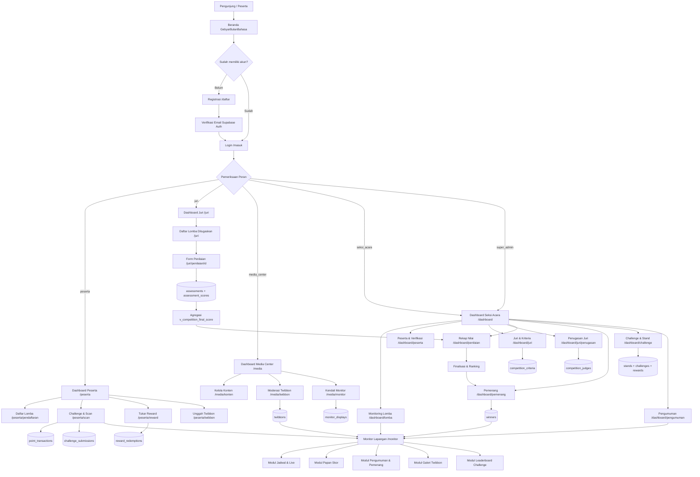
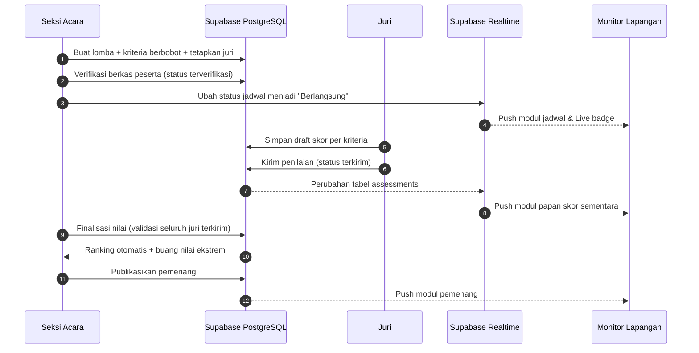

# GebyarBulanBahasa

---

## 1. Ringkasan & Tujuan Aplikasi
- **Nama Aplikasi**: GebyarBulanBahasa — Sistem Penilaian Digital & Dashboard Operasional Acara
- **Penjelasan Singkat**: Platform terpadu untuk mengelola seluruh rangkaian acara **Gebyar Bulan Bahasa dan Kebudayaan (Peringatan Hari Sumpah Pemuda)** bertema *"Berkarya dengan Bahasa, Bersatu dalam Budaya, Menginspirasi Indonesia."* — mulai dari pendaftaran peserta, penilaian digital real-time oleh juri, challenge interaktif non-lomba, moderasi twibbon, hingga penayangan hasil di monitor lapangan.
- **Masalah yang Diselesaikan**:
  - Penilaian lomba masih manual (kertas/Excel) sehingga rekap lambat dan rawan salah hitung saat 8 lomba berjalan paralel.
  - Penugasan juri ke lomba tidak tercatat rapi, memicu jadwal bentrok dan juri menilai lomba yang bukan bidangnya.
  - Peserta non-lomba tidak punya aktivitas terukur, sehingga acara terasa sepi di area stand.
  - Informasi jadwal, skor sementara, dan pengumuman tersebar di grup WhatsApp dan tidak terbaca peserta di lapangan.
  - Verifikasi berkas peserta (kartu pelajar, surat izin, karya) tidak tertelusuri statusnya.
  - Konten twibbon dan dokumentasi acara tidak terkonsolidasi dan tidak termoderasi.
- **Pengguna Aplikasi**:
  - **Seksi Acara / Penanggung Jawab Acara**: memonitor seluruh lomba, mengelola peserta, jadwal, juri, kriteria, rekap nilai, penetapan pemenang, pengumuman, dan challenge.
  - **Juri / Penilai Lomba**: menilai peserta per kriteria pada lomba yang ditugaskan, melihat riwayat penilaian.
  - **Media Center**: mengelola konten acara, pengumuman, moderasi twibbon, dan mengatur tayangan monitor lapangan.
  - **Peserta**: mengikuti challenge non-lomba, mengumpulkan poin lewat scan QR / kode unik stand, menukar reward, mengunggah twibbon, dan memantau status pendaftaran.
  - **Publik / Pengunjung**: melihat jadwal, papan skor, pengumuman, galeri twibbon, leaderboard challenge, dan daftar pemenang tanpa login.
- **Target Keberhasilan**:
  - 100% nilai 8 lomba (Membaca Puisi, Film Pendek, Pidato, Melukis Tas Kanvas, Monolog, MC Formal, Palang Pintu, Vokal Grup) masuk secara digital tanpa kertas.
  - Waktu rekapitulasi nilai dari ~3 jam menjadi < 1 menit setelah juri terakhir menekan kirim.
  - Minimal 300 transaksi poin challenge tercatat dalam 2 hari acara dengan leaderboard yang selalu sinkron.
  - Monitor lapangan menampilkan data ter-update maksimal 5 detik setelah perubahan.
  - Minimal 200 twibbon peserta terunggah dan termoderasi dengan waktu tunggu moderasi < 30 menit.

---

## 2. Batasan Pembuatan Sistem (Versi Awal MVP)
### ✅ Yang Dikerjakan:
- Autentikasi Email & Password dengan Supabase Auth (registrasi, login, lupa password, verifikasi email) untuk 4 peran: Seksi Acara, Juri, Media Center, Peserta.
- Dashboard Seksi Acara: monitoring seluruh lomba, manajemen peserta + verifikasi berkas, manajemen jadwal, manajemen juri & kriteria penilaian, penugasan juri per lomba, rekap nilai otomatis, penetapan & pengumuman pemenang, broadcast pengumuman.
- Dashboard Juri: daftar lomba yang ditugaskan, form penilaian digital per kriteria, penyimpanan draft, pengiriman final, riwayat penilaian.
- Dashboard Media Center: kelola konten acara, kelola pengumuman, moderasi twibbon, pengaturan tayangan monitor lapangan.
- Dashboard Peserta: challenge keliling stand (scan QR & input kode unik), challenge unggah bukti, tracking poin, leaderboard, penukaran reward, unggah twibbon.
- Penilaian digital per lomba dengan kriteria berbobot, agregasi otomatis multi-juri (rata-rata / total / buang nilai ekstrem).
- Halaman Monitor Lapangan fullscreen (jadwal & status berlangsung, papan skor sementara, pengumuman/pemenang, galeri twibbon, leaderboard challenge).
- Galeri twibbon publik, halaman pemenang, papan skor publik, dan pengumuman publik.

### ⛔ Yang Tidak Dikerjakan di Versi Awal:
- Tidak ada modul pembayaran / payment gateway (seluruh lomba dan challenge gratis, tanpa biaya pendaftaran).
- Tidak ada aplikasi mobile native (Android/iOS) — fokus pada web responsif (mobile-first PWA-ready).
- Tidak ada live streaming video dan integrasi OBS/vMix overlay otomatis.
- Tidak ada penilaian offline / mode tanpa internet.
- Tidak ada penjurian publik (public voting) — hanya juri terverifikasi yang menilai.
- Tidak ada chat internal antar panitia (broadcast via pengumuman + email saja).
- Tidak ada integrasi WhatsApp Business API (tahap lanjutan).
- Tidak ada multi-tahun / multi-event — satu instance untuk satu gelaran acara.

---

## 3. Daftar Halaman & Struktur Menu (Pages & Routing)

### A. Public Area (Tanpa Login)
- `/` (Beranda): Hero tema acara, countdown, ringkasan 8 lomba, jadwal hari ini, pengumuman terbaru, leaderboard challenge mini.
- `/tentang` (Tentang Acara): Latar belakang Sumpah Pemuda, visi tema, susunan panitia, logo & identitas acara.
- `/lomba` (Katalog Lomba): Grid 8 lomba dengan filter kategori (Individu/Kelompok) dan status (Pendaftaran/Berlangsung/Selesai).
- `/lomba/[slug]` (Detail Lomba): Deskripsi, kriteria penilaian, jadwal, venue, daftar peserta terverifikasi, papan skor sementara.
- `/jadwal` (Jadwal Acara): Timeline per hari, filter lomba, indikator status live "Sedang Berlangsung".
- `/pengumuman` (Daftar Pengumuman): List dengan kategori (Umum/Jadwal/Pemenang/Penting).
- `/pengumuman/[slug]` (Detail Pengumuman): Isi lengkap + lampiran + share.
- `/papan-skor` (Papan Skor Publik): Skor sementara seluruh lomba yang sedang berlangsung.
- `/pemenang` (Daftar Pemenang): Juara 1/2/3 tiap lomba + pemenang challenge, dengan filter.
- `/leaderboard` (Leaderboard Challenge): Peringkat poin peserta challenge + progress reward.
- `/galeri/twibbon` (Galeri Twibbon): Grid twibbon disetujui, pencarian nama, lightbox.
- `/challenge` (Info Challenge): Penjelasan challenge, cara dapat poin, daftar reward.
- `/faq` (Tanya Jawab): Akordeon FAQ teknis & acara.
- `/kontak` (Kontak Panitia): Info sekretariat, peta venue, kontak seksi acara.
- `/monitor` (Monitor Lapangan — Layar Utama): Halaman display fullscreen tanpa navbar, auto-rotate modul.
- `/monitor/[slug]` (Monitor Spesifik): Contoh `/monitor/jadwal`, `/monitor/papan-skor`, `/monitor/pemenang`, `/monitor/twibbon`, `/monitor/leaderboard`.
- `/twibbon/unggah` (Form Unggah Twibbon): Dapat diakses publik dengan verifikasi nama + nomor peserta.

### B. Auth Area
- `/masuk` (Login): Email & Password, redirect otomatis sesuai peran.
- `/daftar` (Registrasi): Pilih peran Peserta (peran internal dibuat oleh Seksi Acara/Super Admin).
- `/lupa-password` (Lupa Password): Kirim tautan reset via email.
- `/reset-password` (Reset Password): Form password baru dari tautan email.
- `/verifikasi-email` (Konfirmasi Email): Status verifikasi akun Supabase Auth.

### C. Dashboard Seksi Acara / Penanggung Jawab (`/dashboard`)
- `/dashboard` (Ringkasan Operasional): Kartu metrik (total peserta, peserta terverifikasi, lomba berlangsung, juri belum mengirim nilai), feed aktivitas.
- `/dashboard/lomba` (Monitoring Semua Lomba): Tabel 8 lomba dengan status, jumlah peserta, progres penilaian, aksi cepat buka/tutup lomba.
- `/dashboard/lomba/[slug]` (Detail Monitoring Lomba): Timeline penilaian, daftar juri, progress bar pengiriman nilai, breakdown skor peserta.
- `/dashboard/peserta` (Manajemen Peserta): Tabel peserta, filter status verifikasi, pencarian, ekspor CSV.
- `/dashboard/peserta/[id]` (Detail Peserta): Biodata, berkas, riwayat lomba, riwayat poin challenge.
- `/dashboard/peserta/verifikasi` (Verifikasi Berkas): Antrean berkas menunggu, aksi setujui/tolak + catatan.
- `/dashboard/pendaftaran` (Pendaftaran Lomba): Daftar registrasi peserta ke lomba, kelola anggota tim untuk lomba kelompok (Film Pendek, Vokal Grup, Palang Pintu).
- `/dashboard/jadwal` (Manajemen Jadwal): CRUD jadwal, penanda status live, pengaturan panggung/venue.
- `/dashboard/juri` (Manajemen Juri): Daftar akun juri, keahlian/bidang, status aktif, buat akun juri baru.
- `/dashboard/juri/penugasan` (Penugasan Juri ke Lomba): Matrix juri × lomba, tetapkan juri utama (chief judge), bobot juri bila diperlukan.
- `/dashboard/kriteria` (Kriteria Penilaian): CRUD kriteria per lomba, bobot, rentang skor, preview total.
- `/dashboard/penilaian` (Rekap Nilai): Pilih lomba → tabel skor per juri, total terbobot, status finalisasi.
- `/dashboard/penilaian/[competitionId]` (Detail Rekap & Agregasi): Skor per kriteria, agregasi multi-juri, tombol finalisasi.
- `/dashboard/pemenang` (Penetapan Pemenang): Ranking otomatis, tetapkan manual bila seri, publikasikan pemenang.
- `/dashboard/pengumuman` (Kelola Pengumuman): CRUD pengumuman, kategori, pin, jadwal tayang, target audiens.
- `/dashboard/broadcast` (Broadcast Informasi): Kirim pengumuman penting ke role tertentu + tampilkan di monitor.
- `/dashboard/challenge` (Kelola Challenge): CRUD challenge, tipe (scan QR / kode unik / unggah bukti / input panitia), reward poin.
- `/dashboard/challenge/stand` (Kelola Stand): CRUD stand lomba, kode unik, token QR, poin per kunjungan, batas kunjungan.
- `/dashboard/challenge/verifikasi` (Verifikasi Bukti Challenge): Antrean bukti unggahan peserta, setujui/tolak + poin.
- `/dashboard/challenge/poin` (Penyesuaian Poin Manual): Input poin manual oleh panitia untuk peserta tertentu.
- `/dashboard/challenge/reward` (Kelola Reward): Katalog reward, kuota, poin yang dibutuhkan, proses penukaran.
- `/dashboard/challenge/leaderboard` (Leaderboard Internal): Peringkat real-time + ekspor.
- `/dashboard/twibbon` (Moderasi Twibbon): Antrean twibbon, setujui/tolak + alasan, toggle tampil di monitor.
- `/dashboard/pengguna` (Kelola Pengguna & Peran): CRUD akun, ubah peran, aktif/nonaktifkan akun.
- `/dashboard/pengaturan` (Pengaturan Acara): Identitas acara, logo, tanggal, tema, periode pendaftaran, konfigurasi monitor.

### D. Dashboard Juri (`/juri`)
- `/juri` (Beranda Juri): Kartu lomba yang ditugaskan, status pengiriman nilai.
- `/juri/lomba/[slug]` (Daftar Peserta Lomba): Tabel peserta + status penilaian (Belum/Draft/Terkirim).
- `/juri/penilaian/[registrationId]` (Form Penilaian): Input skor per kriteria dengan slider/stepper, catatan, simpan draft, kirim final.
- `/juri/riwayat` (Riwayat Penilaian): Log semua penilaian yang pernah dikirim beserta waktu.
- `/juri/profil` (Profil Juri): Data diri, bidang keahlian, ganti password.

### E. Dashboard Media Center (`/media`)
- `/media` (Ringkasan Media): Metrik konten, twibbon menunggu moderasi, status monitor.
- `/media/konten` (Kelola Konten Acara): CRUD konten (poster, reels, berita, dokumentasi), unggah ke Supabase Storage.
- `/media/pengumuman` (Kelola Pengumuman): CRUD pengumuman versi media center.
- `/media/twibbon` (Moderasi Twibbon): Antrean & galeri moderasi.
- `/media/monitor` (Kendali Monitor Lapangan): Pilih layout, atur durasi rotasi, aktif/nonaktifkan modul, pratinjau live.
- `/media/konten-monitor` (Playlist Monitor): Susun urutan item tayang (pengumuman, jadwal, papan skor, pemenang, galeri, leaderboard).
- `/media/galeri` (Galeri Dokumentasi): Kelola album foto/video acara.

### F. Dashboard Peserta (`/peserta`)
- `/peserta` (Beranda Peserta): Saldo poin, progress challenge, reward berikutnya, pengumuman.
- `/peserta/pendaftaran` (Status Pendaftaran): Status verifikasi lomba yang diikuti + berkas.
- `/peserta/challenge` (Daftar Challenge): Challenge aktif, progress, tombol scan/input kode.
- `/peserta/scan` (Scan QR Stand): Kamera scan QR atau input kode unik stand manual.
- `/peserta/riwayat-poin` (Riwayat Poin): Ledger poin masuk/keluar beserta sumbernya.
- `/peserta/reward` (Tukar Reward): Katalog reward, tukar poin, status penukaran.
- `/peserta/twibbon` (Twibbon Saya): Unggah & status moderasi twibbon milik sendiri.
- `/peserta/profil` (Profil Peserta): Biodata, instansi, ganti password.

---

## 4. Pedoman UI/UX & Design System
- **Filosofi Desain**: *Minimalist & Typography Focused* — hirarki dibangun dari ukuran dan berat huruf, bukan dari warna atau efek. Banyak whitespace, garis pemisah 1px berwarna sangat tipis, tanpa gradien ramai, tanpa shadow tebal.
- **Skema Warna**:
  - Primary (Ink): `hsl(226, 18%, 12%)` — hitam tinta untuk teks utama, heading, dan tombol utama.
  - Accent (Emas Sumpah Pemuda): `hsl(38, 82%, 50%)` — aksen utama untuk highlight, badge juara, dan CTA sekunder.
  - Danger (Merah Bata): `hsl(354, 62%, 44%)` — untuk status live, peringatan, dan penolakan.
  - Success (Hijau Pucuk): `hsl(158, 42%, 36%)` — untuk status terverifikasi dan approved.
  - Background: `hsl(40, 24%, 99%)` — putih hangat, bukan putih murni.
  - Surface/Muted: `hsl(40, 16%, 96%)` — latar kartu sekunder dan zebra table.
  - Border: `hsl(40, 10%, 89%)` — garis 1px sangat tipis, tanpa border ganda.
  - Foreground Muted: `hsl(226, 8%, 46%)` — teks keterangan, label, dan metadata.
- **Tipografi**:
  - Heading & Display: **Instrument Sans** (weight 600–700), tracking `-0.02em`, ukuran hero `clamp(2.5rem, 6vw, 4.5rem)`.
  - Body & UI: **Inter** (weight 400–500), ukuran dasar 16px, line-height 1.65 untuk paragraf panjang.
  - Angka, Skor, Timer, Kode Stand: **JetBrains Mono** dengan `font-variant-numeric: tabular-nums` agar kolom skor rata sempurna.
  - Skala tipografi: `text-xs (12) → sm (14) → base (16) → lg (18) → xl (20) → 2xl (24) → 3xl (30) → 4xl (36) → 5xl (48) → 6xl (60)`.
- **Aturan Komponen**:
  - Sudut: `rounded-lg` (8px) untuk input/tombol, `rounded-xl` (12px) untuk kartu, `rounded-full` hanya untuk badge & avatar.
  - Elevasi: kartu default **tanpa shadow**, hanya `border border-[--border]`; `shadow-sm` hanya untuk dropdown/popover; `shadow-md` untuk dialog.
  - Tombol: Primary = latar Ink + teks putih; Secondary = border tipis + teks Ink; Ghost = tanpa border; Destructive = latar Danger. Tinggi konsisten 40px (`h-10`).
  - Form: label selalu di atas input (bukan placeholder-only), helper text 12px warna muted, error state border Danger + pesan 12px.
  - Tabel: header uppercase 11px `tracking-widest` warna muted, baris tinggi 52px, divider 1px hanya horizontal.
  - Badge status: outline tipis + dot 6px, teks 11px uppercase — `Terjadwal`, `Berlangsung`, `Selesai`, `Menunggu Verifikasi`, `Terverifikasi`, `Ditolak`.
  - Skor: angka besar `text-4xl` JetBrains Mono + label kriteria di bawahnya, bukan progress bar ramai.
  - Monitor Lapangan: kontras tinggi, teks minimal 32px untuk keterbacaan dari jarak 10 meter, latar `hsl(226, 18%, 12%)` dengan teks putih.
- **Nuansa & Vibe**: Tenang, editorial, seperti katalog pameran — bukan dashboard ramai. Micro-animation terbatas (fade-in 200ms, hover opacity 120ms, count-up angka 400ms). Ikon memakai Lucide dengan `stroke-width 1.5`. Semua halaman wajib memiliki state **loading (skeleton), empty (ilustrasi teks + CTA), dan error**.

---

## 5. Pembagian Hak Akses Pengguna
| Menu / Halaman | Publik | Peserta | Juri | Media Center | Seksi Acara / Super Admin |
| :--- | :---: | :---: | :---: | :---: | :---: |
| Beranda, Tentang, FAQ, Kontak | ✅ | ✅ | ✅ | ✅ | ✅ |
| Katalog & Detail Lomba | ✅ | ✅ | ✅ | ✅ | ✅ |
| Jadwal Acara | ✅ | ✅ | ✅ | ✅ | ✅ |
| Pengumuman Publik | ✅ | ✅ | ✅ | ✅ | ✅ |
| Papan Skor & Daftar Pemenang | ✅ | ✅ | ✅ | ✅ | ✅ |
| Galeri Twibbon | ✅ | ✅ | ✅ | ✅ | ✅ |
| Leaderboard Challenge | ✅ | ✅ | ✅ | ✅ | ✅ |
| Monitor Lapangan (`/monitor`) | ✅ | ✅ | ✅ | ✅ | ✅ |
| Unggah Twibbon | ✅ | ✅ | ❌ | ✅ | ✅ |
| Dashboard Peserta & Penukaran Reward | ❌ | ✅ | ❌ | ❌ | ✅ |
| Scan QR / Input Kode Stand | ❌ | ✅ | ❌ | ❌ | ✅ |
| Form Penilaian & Riwayat Nilai | ❌ | ❌ | ✅ | ❌ | ✅ |
| Monitoring Semua Lomba & Jadwal | ❌ | ❌ | ❌ | ❌ | ✅ |
| Manajemen Peserta & Verifikasi Berkas | ❌ | ❌ | ❌ | ❌ | ✅ |
| Manajemen Juri, Kriteria & Penugasan Penilai | ❌ | ❌ | ❌ | ❌ | ✅ |
| Rekap Nilai & Penetapan Pemenang | ❌ | ❌ | ❌ | ❌ | ✅ |
| Kelola Pengumuman & Broadcast | ❌ | ❌ | ❌ | ✅ | ✅ |
| Kelola Konten Acara & Galeri Dokumentasi | ❌ | ❌ | ❌ | ✅ | ✅ |
| Moderasi Twibbon | ❌ | ❌ | ❌ | ✅ | ✅ |
| Kendali Monitor Lapangan & Playlist | ❌ | ❌ | ❌ | ✅ | ✅ |
| Kelola Challenge, Stand, Reward & Verifikasi Poin | ❌ | ❌ | ❌ | ❌ | ✅ |
| Kelola Pengguna & Peran | ❌ | ❌ | ❌ | ❌ | ✅ |
| Pengaturan Acara (identitas, periode, konfigurasi) | ❌ | ❌ | ❌ | ❌ | ✅ |

---

## 6. Alur Kerja dan Fitur Utama

### A. Monitoring Seluruh Lomba & Jadwal (Seksi Acara)
1. **Cara Kerja**: Seksi Acara login → diarahkan ke `/dashboard` → melihat kartu metrik (total peserta, peserta terverifikasi, lomba berlangsung, juri belum kirim nilai) → membuka `/dashboard/lomba` untuk tabel 8 lomba → memilih satu lomba untuk membuka `/dashboard/lomba/[slug]` → memantau progress bar pengiriman nilai tiap juri dan timeline penilaian → membuka `/dashboard/jadwal` untuk menandai status jadwal menjadi `Berlangsung` saat lomba dimulai, sehingga tampil live di halaman publik dan monitor lapangan.
2. **Aturan Sistem**:
   - Hanya satu jadwal boleh berstatus `Berlangsung` pada panggung yang sama dalam satu waktu; sistem menampilkan konfirmasi bila terjadi bentrok.
   - Perubahan status jadwal menjadi `Berlangsung` otomatis muncul di `/jadwal` dan `/monitor/jadwal` maksimal 5 detik (Supabase Realtime).
   - Status lomba mengikuti siklus: `draft → pendaftaran → berlangsung → selesai`. Rekap nilai hanya bisa difinalisasi jika status lomba `berlangsung` atau `selesai`.
   - Filter wajib menyediakan opsi: Semua Lomba, Per Hari, Per Kategori (Individu/Kelompok), Per Status.

### B. Manajemen Peserta & Verifikasi Berkas (Seksi Acara)
1. **Cara Kerja**: Peserta melakukan pendaftaran akun di `/daftar` → melengkapi biodata di `/peserta/profil` → mendaftar lomba di `/dashboard/pendaftaran` (atau Seksi Acara menginput manual) → mengunggah berkas (kartu pelajar/KTM, surat izin sekolah, karya untuk Film Pendek & Vokal Grup) → berkas masuk antrean di `/dashboard/peserta/verifikasi` → Seksi Acara membuka detail peserta → menekan **Setujui** atau **Tolak** + alasan → peserta menerima notifikasi → peserta terverifikasi muncul di daftar peserta lomba dan berhak dinilai.
2. **Aturan Sistem**:
   - Setiap peserta memperoleh `registration_number` otomatis berformat `GBB-{KODE_LOMBA}-{URUT}` (contoh: `GBB-PUI-014`).
   - Untuk lomba kelompok (Film Pendek, Vokal Grup, Palang Pintu), wajib mengisi minimal 2 anggota tim dan 1 ketua tim; jumlah anggota divalidasi per lomba.
   - Satu peserta boleh mengikuti maksimal 3 lomba individu (dapat dikonfigurasi di `/dashboard/pengaturan`).
   - Berkas yang ditolak wajib disertai alasan dan peserta dapat mengunggah ulang maksimal 2 kali.
   - Penilaian juri otomatis terkunci untuk peserta berstatus `menunggu_verifikasi` atau `ditolak`.
   - Semua perubahan status verifikasi wajib dicatat di `activity_logs` (siapa, kapan, status lama → baru).

### C. Manajemen Juri, Kriteria & Penugasan Penilai (Seksi Acara)
1. **Cara Kerja**: Seksi Acara membuka `/dashboard/juri` → menekan **Tambah Juri** → mengisi nama, email, bidang keahlian (contoh: Sastra, Sinematografi, Public Speaking, Seni Rupa, Teater, Protokoler, Tradisi Betawi, Musik) → sistem membuat akun dengan peran `juri` dan mengirim kredensial awal via email → Seksi Acara membuka `/dashboard/juri/penugasan` → memilih kombinasi juri × lomba menggunakan **matriks penugasan** → menandai salah satu juri sebagai **Juri Utama** → menyimpan → juri tersebut langsung melihat lomba pada `/juri`.
2. **Cara Kerja Kriteria**: Seksi Acara membuka `/dashboard/kriteria` → memilih lomba → menambah kriteria (nama, deskripsi, bobot, skor maksimal) → melihat pratinjau total bobot → menyimpan. Contoh kriteria Pidato: *Isi & Relevansi Tema (30%), Ketepatan Bahasa Indonesia (25%), Retorika & Daya Pikat (25%), Sikap & Penampilan (20%)*.
3. **Aturan Sistem**:
   - Satu lomba wajib memiliki minimal 1 juri dan maksimal 5 juri; sistem memblokir finalisasi rekap bila belum ada juri aktif.
   - Total bobot kriteria wajib tepat `100%`; bila tidak, tombol melengkapi penugasan tetap nonaktif dan muncul peringatan.
   - Satu juri hanya dapat ditugaskan pada satu lomba secara bersamaan untuk mencegah penilaian tumpang tindih; penugasan pada beberapa lomba diperbolehkan apabila jadwalnya berbeda hari/waktu.
   - Juri tidak dapat melihat skor juri lain selama status penilaian masih `draft` (mencegah bias), dan dapat melihat agregat setelah nilai berstatus `terkirim`.
   - Juri hanya dapat menilai registrasi dengan `competition_id` yang sesuai dengan penugasannya — ditegakkan di level Row Level Security Supabase dan divalidasi ulang di Server Action.
   - Perubahan kriteria setelah ada nilai masuk akan ditandai sebagai *versi kriteria* dan memicu perhitungan ulang total; sistem menampilkan peringatan konfirmasi sebelum menyimpan.

### D. Penilaian Digital oleh Juri (per Lomba)
1. **Cara Kerja**: Juri login → masuk ke `/juri` → memilih lomba yang ditugaskan → melihat tabel peserta dengan indikator status (Belum Dinilai / Draft / Terkirim) → memilih peserta → membuka `/juri/penilaian/[registrationId]` → mengisi skor tiap kriteria (input numerik + slider) → menambahkan catatan kualitatif (opsional) → menekan **Simpan Draft** bila belum yakin → menekan **Kirim Penilaian** setelah selesai → sistem menghitung total terbobot dan menandai penilaian berstatus `terkirim` → sinkron ke rekap `/dashboard/penilaian` dan papan skor sementara.
2. **Aturan Sistem**:
   - Skor per kriteria berupa bilangan bulat `0 – max_score` (default 100) dan tervalidasi Zod di sisi server.
   - Total terbobot per juri = `Σ (skor_kriteria × bobot_kriteria)`, dibulatkan 2 desimal.
   - Penilaian berstatus `draft` tidak dihitung dalam rekap publik maupun papan skor.
   - Setelah `terkirim`, juri tidak dapat mengubah nilai; perubahan hanya dapat dilakukan oleh Seksi Acara melalui jalur **Koreksi Nilai** yang tercatat di `activity_logs`.
   - Juri tidak dapat mengirim penilaian lengkap sebelum seluruh kriteria terisi; tombol Kirim menampilkan jumlah kriteria yang belum terisi.
   - Agregasi multi-juri dihitung otomatis berdasarkan metode lomba:
     - `rata_rata`: rata-rata total terbobot semua juri.
     - `total`: penjumlahan total terbobot semua juri.
     - `rata_rata_buang_ekstrem`: buang nilai tertinggi & terendah, lalu rata-rata (aktif otomatis bila juri ≥ 4).
   - Bila selisih nilai antar-juri melebihi ambang batas (default 20 poin, dikonfigurasi di `/dashboard/pengaturan`), sistem menandai **Perlu Peninjauan** di rekap Seksi Acara.
   - Riwayat penilaian tersimpan permanen di `/juri/riwayat` dengan timestamp dan nama peserta.

### E. Rekap Nilai Otomatis & Penetapan Pemenang (Seksi Acara)
1. **Cara Kerja**: Seksi Acara membuka `/dashboard/penilaian` → memilih lomba → melihat tabel skor per juri, total terbobot, agregat, dan peringkat sementara → membuka `/dashboard/penilaian/[competitionId]` untuk melihat rincian per kriteria → menekan **Finalisasi Nilai** saat seluruh juri telah mengirim → sistem memvalidasi kelengkapan → Seksi Acara membuka `/dashboard/pemenang` → sistem menampilkan ranking otomatis → Seksi Acara menetapkan Juara 1/2/3 (dan Juara Harapan bila diinginkan), menambahkan hadiah/penghargaan → menekan **Publikasikan Pemenang** → pemenang tampil di `/pemenang`, `/papan-skor`, dan `/monitor/pemenang`.
2. **Aturan Sistem**:
   - Finalisasi hanya bisa dilakukan bila `jumlah_penilaian_terkirim = jumlah_juri_aktif` pada lomba tersebut.
   - Ranking otomatis memakai `total_final`; bila terjadi seri, sistem memprioritaskan `kompetisi` skor tertinggi pada kriteria dengan bobot terbesar, lalu menampilkan tombol **Tetapkan Manual** dengan wajib catatan alasan.
   - Setelah dipublikasikan, nilai bersifat *read-only* kecuali dibuka kembali oleh Seksi Acara dengan alasan yang tercatat.
   - Publikasi pemenang otomatis membuat entri pengumuman berkategori `pemenang` dan mendorong tayangan ke monitor lapangan.
   - Ekspor rekap nilai tersedia dalam format CSV dan cetak PDF berisi kop acara.

### F. Challenge Peserta Non-Lomba & Sistem Poin
1. **Cara Kerja**:
   - **Challenge Keliling Stand (Scan QR)**: Peserta login → membuka `/peserta/scan` → memindai QR di stand lomba → sistem mengenali `qr_token` stand → memvalidasi (belum pernah dikunjungi / batas kunjungan belum tercapai) → poin otomatis masuk → muncul notifikasi poin bertambah.
   - **Challenge Kode Unik Stand**: Peserta yang kamera tidak berfungsi memasukkan kode unik 6 karakter (contoh `PUISI01`) di `/peserta/scan` → sistem memvalidasi kode → poin masuk.
   - **Challenge Unggah Bukti**: Peserta membuka `/peserta/challenge` → memilih challenge (misal: *Rekam Video Ikrar Sumpah Pemuda*, *Kuis Bahasa Indonesia*, *Tantangan Twibbon*) → mengunggah bukti (foto/video/tautan) → berstatus `menunggu` → Media Center/Seksi Acara memverifikasi di `/dashboard/challenge/verifikasi` → poin diberikan bila disetujui.
   - **Input Poin Manual Panitia**: Seksi Acara membuka `/dashboard/challenge/poin` → mencari peserta → memilih sumber poin dan alasan → menyimpan → tercatat di ledger poin peserta.
   - **Tracking Progress**: Peserta memantau di `/peserta` (progress challenge, poin, reward berikutnya) dan `/peserta/riwayat-poin`; publik memantau di `/leaderboard`.
   - **Penukaran Reward**: Peserta membuka `/peserta/reward` → memilih reward → sistem memotong poin → status `menunggu` → Seksi Acara memproses di `/dashboard/challenge/reward` → status `diserahkan`.
2. **Aturan Sistem**:
   - Poin per stand default 10 poin, maksimal 1 kali kunjungan per peserta per stand (unik constraint `(participant_id, stand_id)`).
   - Poin challenge unggah bukti ditentukan saat pembuatan challenge (default 25–100 poin) dan tidak diberikan sebelum disetujui.
   - Poin tidak pernah dihapus; koreksi dilakukan dengan entri baru bertipe `penyesuaian` bernilai negatif, sehingga ledger tetap auditable.
   - Leaderboard dihitung dari `SUM(points)` per peserta, diperbarui real-time, dan mengabaikan peserta dengan total 0.
   - Reward dengan kuota habis otomatis tidak dapat ditukar; penukaran gagal mengembalikan poin secara otomatis.
   - Setiap transaksi poin wajib memiliki `source` dan `granted_by` (kecuali scan QR otomatis yang menggunakan `granted_by = null`).

### G. Monitor Lapangan (Display)
1. **Cara Kerja**: Layar TV di lapangan membuka `/monitor` (dapat memakai `?token=` opsional untuk mencegah penyalahgunaan) → halaman tampil fullscreen tanpa navigasi → sistem merotasi modul sesuai `rotation_interval_seconds` (default 15 detik) mengikuti playlist yang disusun di `/media/konten-monitor` → setiap modul memuat data terbaru secara real-time → Media Center dapat mengganti tayangan mendesak (misal pengumuman penting) melalui tombol **Tayangkan Sekarang** di `/media/monitor`.
2. **Modul yang ditampilkan**:
   - **Jadwal & Status Berlangsung**: daftar lomba hari ini beserta panggung, jam, dan penanda LIVE berdenyut.
   - **Papan Skor Sementara**: skor agregat 5 besar lomba yang sedang berlangsung (tanpa menampilkan skor juri individual).
   - **Pengumuman & Pemenang**: teks pengumuman berkategori `penting` dan kartu pemenang.
   - **Galeri Twibbon**: rotasi twibbon disetujui (maksimal 12 twibbon per siklus).
   - **Leaderboard Challenge**: 10 besar perolehan poin peserta non-lomba.
3. **Aturan Sistem**:
   - Halaman monitor tidak membutuhkan login, namun wajib `noindex, nofollow` dan tidak menampilkan data pribadi (nomor telepon, email, NISN).
   - Jika koneksi terputus, layar menampilkan indikator "Menghubungkan ulang…" dan mempertahankan data terakhir.
   - Perubahan pengumuman, pemenang, atau status lomba tampil di monitor maksimal 5 detik setelah disimpan (Supabase Realtime broadcast).
   - Rotasi modul dijeda otomatis selama 20 detik ketika ada **Pengumuman Darurat** yang ditayangkan paksa.
   - Font minimum 32px, kontras minimum rasio 7:1, dan tidak ada animasi yang mengganggu keterbacaan.

### H. Twibbon (Unggah, Moderasi, Galeri)
1. **Cara Kerja**: Peserta/pengunjung membuka `/twibbon/unggah` → mengisi nama, nomor peserta (opsional), caption → mengunggah gambar (JPG/PNG, maksimal 5MB) → gambar tersimpan di Supabase Storage bucket `twibbon` → status `menunggu` → Media Center membuka `/media/twibbon` (atau Seksi Acara di `/dashboard/twibbon`) → menyetujui atau menolak + alasan → twibbon disetujui muncul di `/galeri/twibbon` dan berpotensi tampil di `/monitor/twibbon`.
2. **Aturan Sistem**:
   - Format file dibatasi JPG/PNG/WebP; rasio disarankan 1:1 atau 4:5; validasi tipe MIME dilakukan di klien dan server.
   - Nama file disimpan dengan UUID untuk mencegah tabrakan dan penyalahgunaan, disertai `uploader_ip` untuk pembatasan spam.
   - Maksimal 3 unggahan per pengunjung per hari (rate limit berbasis IP + sesi).
   - Moderasi bersifat opsional berdasarkan pengaturan acara; jika moderasi dimatikan, twibbon langsung berstatus `disetujui`.
   - Twibbon yang ditolak tidak ditampilkan publik namun tetap tampil di halaman `/peserta/twibbon` milik pengunggah beserta alasan penolakan.
   - Media Center dapat menandai twibbon sebagai **Unggulan** agar diprioritaskan pada rotasi monitor.

### I. Pengumuman, Broadcast & Pemenang
1. **Cara Kerja**: Seksi Acara/Media Center membuka `/dashboard/pengumuman` atau `/media/pengumuman` → menekan **Buat Pengumuman** → mengisi judul, kategori (Umum/Jadwal/Pemenang/Penting), isi, lampiran, target audiens, dan jadwal tayang → menyimpan sebagai draft atau langsung publikasikan → bila ditandai **Penting**, pengumuman otomatis muncul sebagai banner di `/pengumuman`, beranda, dan mengambil alih tayangan monitor selama 20 detik → untuk pengumuman pemenang, sistem dapat dibuat otomatis dari `/dashboard/pemenang` saat menekan **Publikasikan Pemenang**.
2. **Aturan Sistem**:
   - Pengumuman publik wajib memiliki slug unik untuk keperluan SEO (`/pengumuman/[slug]`).
   - Pengumuman berkategori `penting` maksimal 3 aktif bersamaan agar tidak memenuhi layar utama.
   - Pengumuman dapat memiliki `publish_at` dan `expire_at`; sistem menyembunyikan otomatis setelah kedaluwarsa.
   - Notifikasi email dikirim ke role target bila opsi **Kirim Notifikasi** dicentang.
   - Semua publikasi pemenang wajib mengacu pada hasil finalisasi nilai; sistem menolak publikasi bila lomba belum difinalisasi.

### J. Media Center & Konten Acara
1. **Cara Kerja**: Media Center login → masuk ke `/media` → membuka `/media/konten` → mengunggah konten (poster, reels, berita, dokumentasi) ke Supabase Storage bucket `media-acara` → mengisi judul, kategori, caption, dan status → konten tampil di `/tentang` dan galeri publik → membuka `/media/konten-monitor` untuk menyusun urutan tayangan monitor → membuka `/media/monitor` untuk pratinjau dan pengaturan rotasi.
2. **Aturan Sistem**:
   - Semua media disimpan di bucket `media-acara` (publik baca) dan `dokumen-peserta` (privat, akses via signed URL).
   - Playlist monitor minimal berisi 1 modul aktif; sistem menolak menyimpan playlist kosong.
   - Perubahan playlist langsung berlaku pada siklus rotasi berikutnya tanpa perlu refresh layar monitor.
   - Media Center tidak dapat mengakses modul peserta, juri, rekap nilai, atau penetapan pemenang.

---

## 7. Alur Navigasi & Arsitektur Layout
### Arsitektur Layout (Persisten)
- **Public Layout**: Header tipis (tinggi 64px, sticky, border-bottom 1px) berisi logo GebyarBulanBahasa, menu navigasi horizontal, dan tombol **Masuk**; Footer minimalis berisi identitas acara, tautan cepat, dan kredit panitia.
- **Auth Layout**: Dua kolom — kolom kiri form (maksimal 420px, terpusat vertikal), kolom kanan panel tipografi besar berisi tema acara; pada mobile hanya kolom form.
- **Dashboard Layout (Seksi Acara, Media Center)**: Sidebar kiri `fixed` (lebar 264px, dapat diciutkan menjadi 72px) + Header kecil di atas menampilkan breadcrumb, pencarian global, lonceng notifikasi, dan menu profil; konten utama maksimal 1440px dengan padding 32px.
- **Dashboard Layout (Juri, Peserta)**: Sidebar kiri versi lebih sederhana (maksimal 5 menu) + Header dengan indikator saldo poin (khusus peserta) atau penugasan aktif (khusus juri).
- **Monitor Layout**: Tanpa navbar, tanpa footer, tanpa scroll, latar gelap penuh, hanya area konten dengan indikator waktu berjalan dan status koneksi realtime.

### Bagan Alur (Flowchart)





---

## 8. Kebutuhan Non-Fungsional (SEO, Keamanan, & Performa)
- **SEO**:
  - Tag `<title>` dinamis per halaman dengan pola `{Judul Halaman} | GebyarBulanBahasa 2025`.
  - Meta description unik untuk `/`, `/lomba`, `/lomba/[slug]`, `/jadwal`, `/pengumuman/[slug]`, `/pemenang`, `/galeri/twibbon`.
  - Open Graph & Twitter Card pada setiap halaman publik (gambar OG default berisi tema acara).
  - `sitemap.xml` dan `robots.txt` dinamis; halaman `/monitor`, `/dashboard`, `/juri`, `/media`, `/peserta` wajib `noindex, nofollow`.
  - Structured Data JSON-LD tipe `Event` untuk acara dan `ItemList` untuk daftar pemenang.
  - URL detail lomba memakai slug SEO-friendly (`/lomba/membaca-puisi`, `/lomba/film-pendek`).
- **Keamanan**:
  - Supabase Auth dengan Email & Password, verifikasi email wajib untuk akun peserta, dan kebijakan password minimal 8 karakter (huruf besar, huruf kecil, angka).
  - **Row Level Security (RLS) aktif di seluruh tabel**; kolom peran disimpan pada `profiles.role` dan diverifikasi melalui fungsi `security definer` `public.current_role()`.
  - Semua mutasi data dilakukan melalui Server Actions / Route Handlers yang memakai `supabase/server` dan memvalidasi ulang peran — tidak ada penulisan langsung dari klien.
  - Validasi input dengan **Zod** di klien dan server untuk setiap form (skor, poin, tanggal, upload).
  - Proteksi XSS dengan React escaping bawaan, sanitasi HTML pada isi pengumuman (izinkan subset tag), dan header `Content-Security-Policy`.
  - Rate limiting untuk login, unggah twibbon, scan QR, dan input kode stand (maksimal 10 percobaan/menit per IP).
  - Bucket `dokumen-peserta` bersifat privat; akses hanya melalui signed URL berumur pendek (60 menit).
  - Semua aksi kritis (finalisasi nilai, penetapan pemenuan, perubahan peran, penyesuaian poin) dicatat di `activity_logs`.
  - Proteksi CSRF pada Server Actions Next.js dan verifikasi origin request untuk endpoint internal.
- **Performa**:
  - Optimasi gambar dengan `next/image` dan Supabase Storage transformation (resize otomatis `width=800&quality=75`).
  - Caching data publik (`/lomba`, `/jadwal`, `/pemenang`, `/galeri/twibbon`) memakai ISR dengan revalidasi 60 detik.
  - Lazy loading untuk komponen berat: galeri twibbon, chart rekap nilai, tabel besar dengan paginasi server-side 25 baris.
  - Indeks database pada kolom yang sering difilter: `registrations.competition_id`, `assessments.judge_id`, `point_transactions.participant_id`, `schedules.event_date`, `awards`/`winners.rank`.
  - Target performa: LCP < 2.5s, CLS < 0.1, INP < 200ms, skor Lighthouse ≥ 90 pada halaman publik.
  - Monitor Lapangan memakai satu query agregat ringan + Supabase Realtime channel, bukan polling berulang.

---

## 9. Panduan Bahasa, Copywriting, & Data Dummy
- **Gaya Bahasa**: Profesional, hangat, dan membumi menggunakan kata **"Anda"** dan **"Kami"**; hindari istilah teknis di halaman publik (gunakan "Papan Skor" bukan "Leaderboard Aggregation", "Berkas Peserta" bukan "Dokumen Submission").
- **Nada Khusus**: Bangga dan reflektif terhadap semangat Sumpah Pemuda, namun tetap ringkas. Contoh kalimat sambutan beranda: *"Satu bahasa, satu bangsa, satu karya. Selamat datang di Gebyar Bulan Bahasa dan Kebudayaan."*
- **Instruksi Data Dummy**: JANGAN PERNAH MENGGUNAKAN "Lorem Ipsum". Selalu gunakan data dummy berbahasa Indonesia yang relevan dengan konteks acara.
  - **Nama Lomba**: Membaca Puisi, Film Pendek, Pidato, Melukis Tas Kanvas, Monolog, MC Formal, Palang Pintu, Vokal Grup.
  - **Contoh Peserta**: Ahmad Fauzan Ramadhan (SMAN 1 Bandung), Nurul Hidayah Salsabila (SMKN 3 Jakarta), Bagas Prasetyo Wibowo (Universitas Indonesia), Kirana Ayu Lestari (SMA Taman Siswa Yogyakarta), Rangga Aditya Nugraha (Universitas Padjadjaran), Zahra Amelia Putri (MAN 2 Malang).
  - **Contoh Juri**: Dr. Siti Nurhaliza M.Pd. (bidang: Sastra & Puisi), Bimo Aryanto S.Sn. (bidang: Sinematografi), Rina Kartika M.I.Kom. (bidang: Public Speaking & MC), Yudi Permana (bidang: Seni Rupa & Kriya), Hendra Gunawan S.Pd. (bidang: Teater & Monolog), Bang Jali Mansur (bidang: Tradisi Betawi & Palang Pintu), Dewi Anggraini M.Mus. (bidang: Musik & Vokal).
  - **Contoh Jadwal**: `Hari 1 — 09:00 Membaca Puisi (Panggung Utama)`, `Hari 1 — 13:00 Monolog (Ruang Teater A)`, `Hari 2 — 08:30 Pidato (Aula Serbaguna)`, `Hari 2 — 10:00 Melukis Tas Kanvas (Area Kreatif)`, `Hari 2 — 14:00 MC Formal (Panggung Utama)`, `Hari 3 — 09:00 Film Pendek (Ruang Bioskop Mini)`, `Hari 3 — 11:00 Palang Pintu (Lapangan Terbuka)`, `Hari 3 — 15:00 Vokal Grup (Panggung Utama)`.
  - **Contoh Kriteria Pidato**: Isi & Relevansi Tema (30%), Ketepatan Bahasa Indonesia (25%), Retorika & Daya Pikat (25%), Sikap & Penampilan (20%). **Kriteria Film Pendek**: Kekuatan Cerita (30%), Sinematografi (25%), Akting (20%), Tata Suara & Musik (15%), Keselarasan Tema (10%).
  - **Contoh Stand & Kode Unik**: `Stand Puisi — PUISI01`, `Stand Film Pendek — FILM02`, `Stand Teater Monolog — MONO03`, `Stand Melukis — KANVAS04`, `Stand MC Formal — MCFRM05`, `Stand Palang Pintu — PALANG06`, `Stand Vokal Grup — VOKAL07`, `Stand Media Center — MEDIA08`. Masing-masing bernilai 10 poin.
  - **Contoh Challenge**: *Keliling 8 Stand Lomba* (80 poin, badge "Penjelajah Bahasa"), *Rekam Video Ikrar Sumpah Pemuda* (50 poin), *Kuis Bahasa Indonesia 10 Soal* (30 poin), *Tantangan Twibbon GebyarBulanBahasa* (20 poin), *Wawancara Juri Favorit* (40 poin).
  - **Contoh Reward**: Pin Edisi Sumpah Pemuda (100 poin, kuota 200), Tote Bag GebyarBulanBahasa (250 poin, kuota 80), Voucher Kopi Nusantara Rp25.000 (150 poin, kuota 120), Buku Antologi Puisi Peserta (400 poin, kuota 30), Tiket Prioritas Kursi Depan Pentas Seni (300 poin, kuota 50).
  - **Contoh Pengumuman**: *"Pengambilan Nomor Peserta Lomba Membaca Puisi dapat dilakukan di Sekretariat Panitia mulai pukul 07.30 WIB."* / *"Peserta wajib hadir 30 menit sebelum jadwal lomba dimulai."* / *"Selamat kepada Ahmad Fauzan Ramadhan sebagai Juara 1 Lomba Membaca Puisi dengan total nilai 92,75."*

---

## 10. Fondasi Teknis (Untuk Tim Pengembang / Programmer & AI)
- **Bahasa & Framework**: Next.js 15 (App Router, React Server Components, Server Actions) + TypeScript 5.
- **Tampilan Antarmuka (UI)**: Tailwind CSS 4 (design token via CSS variables), shadcn/ui (Button, Card, Input, Dialog, Table, Badge, Dropdown, Tabs, Sheet, Select, Textarea, Toast, Accordion, Skeleton), Lucide Icons, Recharts untuk grafik rekap nilai.
- **Autentikasi**: Supabase Auth (Email & Password), `@supabase/ssr` untuk manajemen sesi di server & klien, middleware Next.js untuk proteksi rute dan pengalihan berbasis peran.
- **Basis Data (Database)**: Supabase PostgreSQL (dengan Row Level Security) — diakses melalui `@supabase/supabase-js` dan tipe database yang di-generate `supabase gen types typescript`.
- **Penyimpanan (Storage)**: Supabase Storage dengan 5 bucket: `twibbon` (publik baca), `media-acara` (publik baca), `dokumen-peserta` (privat), `poster-lomba` (publik baca), `avatars` (publik baca).
- **Realtime**: Supabase Realtime (Postgres Changes + Broadcast Channel) untuk monitor lapangan, papan skor, dan leaderboard challenge.
- **Form & Validasi**: React Hook Form + Zod (skema dibagikan antara klien dan server action).
- **QR Code**: `qrcode` untuk generate QR stand, `html5-qrcode` atau `@zxing/browser` untuk scanner di `/peserta/scan`.
- **Deployment**: Vercel (region Singapore) + Supabase (region Singapore).
- **Catatan Penting**: Aplikasi ini **tidak memiliki modul pembayaran** — tidak ada integrasi payment gateway, seluruh fitur acara gratis untuk peserta.

### Struktur Skema Database Nyata

```sql
-- =====================================================================
-- GebyarBulanBahasa — Supabase PostgreSQL Schema
-- File: supabase/migrations/0001_init.sql
-- =====================================================================

create extension if not exists "pgcrypto";
create extension if not exists "uuid-ossp";

-- ---------------------------------------------------------------------
-- ENUM TYPES
-- ---------------------------------------------------------------------
create type user_role as enum ('super_admin','seksi_acara','juri','media_center','peserta');
create type competition_type as enum ('individu','kelompok');
create type competition_status as enum ('draft','pendaftaran','berlangsung','selesai','dibatalkan');
create type aggregation_method as enum ('rata_rata','total','rata_rata_buang_ekstrem');
create type participant_status as enum ('menunggu_verifikasi','terverifikasi','ditolak','mengundurkan_diri');
create type document_status as enum ('menunggu','valid','tidak_valid');
create type judge_assignment_status as enum ('diundang','aktif','nonaktif');
create type assessment_status as enum ('draft','terkirim','final');
create type schedule_status as enum ('terjadwal','berlangsung','selesai','ditunda','dibatalkan');
create type announcement_category as enum ('umum','jadwal','pemenang','penting','media');
create type moderation_status as enum ('menunggu','disetujui','ditolak');
create type challenge_type as enum ('scan_qr','kode_unik','unggah_bukti','input_panitia');
create type point_source as enum ('scan_qr','kode_unik','verifikasi_bukti','input_panitia','penyesuaian');
create type submission_status as enum ('menunggu','disetujui','ditolak');
create type redemption_status as enum ('menunggu','disetujui','diserahkan','ditolak');
create type winner_category as enum ('lomba','challenge');

-- ---------------------------------------------------------------------
-- PROFILES (extends auth.users)
-- ---------------------------------------------------------------------
create table public.profiles (
  id uuid primary key references auth.users(id) on delete cascade,
  email text not null unique,
  full_name text not null,
  nickname text,
  phone text,
  institution text,
  avatar_url text,
  role user_role not null default 'peserta',
  is_active boolean not null default true,
  last_login_at timestamptz,
  created_at timestamptz not null default now(),
  updated_at timestamptz not null default now()
);

create index idx_profiles_role on public.profiles(role);

-- Fungsi bantu RBAC (security definer agar aman dipakai di policy)
create or replace function public.current_role()
returns user_role language sql stable security definer set search_path = public as $$
  select role from public.profiles where id = auth.uid();
$$;

create or replace function public.is_admin()
returns boolean language sql stable security definer set search_path = public as $$
  select coalesce((select role in ('super_admin','seksi_acara') from public.profiles where id = auth.uid()), false);
$$;

create or replace function public.is_staff()
returns boolean language sql stable security definer set search_path = public as $$
  select coalesce((select role in ('super_admin','seksi_acara','media_center') from public.profiles where id = auth.uid()), false);
$$;

-- ---------------------------------------------------------------------
-- EVENT SETTINGS
-- ---------------------------------------------------------------------
create table public.event_settings (
  key text primary key,
  value jsonb not null,
  description text,
  updated_by uuid references public.profiles(id) on delete set null,
  updated_at timestamptz not null default now()
);

-- ---------------------------------------------------------------------
-- COMPETITIONS (8 lomba)
-- ---------------------------------------------------------------------
create table public.competitions (
  id uuid primary key default gen_random_uuid(),
  slug text not null unique,
  name text not null,
  short_name text not null,
  description text not null,
  theme_link text,
  type competition_type not null default 'individu',
  status competition_status not null default 'draft',
  aggregation aggregation_method not null default 'rata_rata',
  min_team_members int not null default 2,
  max_team_members int not null default 10,
  max_participants int,
  registration_open_at timestamptz,
  registration_close_at timestamptz,
  poster_url text,
  rules text,
  sort_order int not null default 0,
  created_by uuid references public.profiles(id) on delete set null,
  created_at timestamptz not null default now(),
  updated_at timestamptz not null default now()
);

create index idx_competitions_status on public.competitions(status);

-- ---------------------------------------------------------------------
-- COMPETITION CRITERIA (kriteria penilaian berbobot)
-- ---------------------------------------------------------------------
create table public.competition_criteria (
  id uuid primary key default gen_random_uuid(),
  competition_id uuid not null references public.competitions(id) on delete cascade,
  name text not null,
  description text,
  weight numeric(5,2) not null default 0,   -- persen, total per lomba = 100
  max_score numeric(6,2) not null default 100,
  sort_order int not null default 0,
  created_at timestamptz not null default now(),
  constraint chk_weight_range check (weight >= 0 and weight <= 100)
);

create index idx_criteria_competition on public.competition_criteria(competition_id);

-- ---------------------------------------------------------------------
-- PARTICIPANTS
-- ---------------------------------------------------------------------
create table public.participants (
  id uuid primary key default gen_random_uuid(),
  user_id uuid unique references public.profiles(id) on delete set null,
  registration_number text not null unique,
  full_name text not null,
  nickname text,
  email text,
  phone text,
  institution text,
  birth_date date,
  address text,
  photo_url text,
  status participant_status not null default 'menunggu_verifikasi',
  verified_by uuid references public.profiles(id) on delete set null,
  verified_at timestamptz,
  rejection_reason text,
  total_points int not null default 0,
  created_at timestamptz not null default now(),
  updated_at timestamptz not null default now()
);

create index idx_participants_status on public.participants(status);
create index idx_participants_user on public.participants(user_id);

-- ---------------------------------------------------------------------
-- PARTICIPANT DOCUMENTS (verifikasi berkas)
-- ---------------------------------------------------------------------
create table public.participant_documents (
  id uuid primary key default gen_random_uuid(),
  participant_id uuid not null references public.participants(id) on delete cascade,
  doc_type text not null,              -- 'kartu_pelajar' | 'surat_izin' | 'karya' | 'lainnya'
  file_url text not null,
  file_name text,
  status document_status not null default 'menunggu',
  note text,
  reviewed_by uuid references public.profiles(id) on delete set null,
  reviewed_at timestamptz,
  uploaded_at timestamptz not null default now()
);

create index idx_documents_participant on public.participant_documents(participant_id);
create index idx_documents_status on public.participant_documents(status);

-- ---------------------------------------------------------------------
-- REGISTRATIONS (pendaftaran peserta ke lomba)
-- ---------------------------------------------------------------------
create table public.registrations (
  id uuid primary key default gen_random_uuid(),
  participant_id uuid not null references public.participants(id) on delete cascade,
  competition_id uuid not null references public.competitions(id) on delete cascade,
  team_name text,
  performance_order int,
  is_confirmed boolean not null default false,
  notes text,
  created_at timestamptz not null default now(),
  unique (participant_id, competition_id)
);

create index idx_registrations_competition on public.registrations(competition_id);

create table public.registration_members (
  id uuid primary key default gen_random_uuid(),
  registration_id uuid not null references public.registrations(id) on delete cascade,
  member_name text not null,
  member_role text,                    -- 'ketua' | 'anggota'
  student_id text,
  institution text,
  is_leader boolean not null default false
);

create index idx_members_registration on public.registration_members(registration_id);

-- ---------------------------------------------------------------------
-- COMPETITION JUDGES (penugasan juri oleh Seksi Acara)
-- ---------------------------------------------------------------------
create table public.competition_judges (
  id uuid primary key default gen_random_uuid(),
  competition_id uuid not null references public.competitions(id) on delete cascade,
  judge_id uuid not null references public.profiles(id) on delete cascade,
  is_chief_judge boolean not null default false,
  expertise_note text,
  status judge_assignment_status not null default 'aktif',
  assigned_by uuid references public.profiles(id) on delete set null,
  assigned_at timestamptz not null default now(),
  unique (competition_id, judge_id)
);

create index idx_judges_competition on public.competition_judges(competition_id);
create index idx_judges_judge on public.competition_judges(judge_id);

-- ---------------------------------------------------------------------
-- SCHEDULES (jadwal acara)
-- ---------------------------------------------------------------------
create table public.schedules (
  id uuid primary key default gen_random_uuid(),
  competition_id uuid references public.competitions(id) on delete set null,
  title text not null,
  description text,
  event_day int not null default 1,
  event_date date not null,
  start_time time not null,
  end_time time,
  venue text not null,
  stage text,
  host_name text,
  status schedule_status not null default 'terjadwal',
  sort_order int not null default 0,
  created_at timestamptz not null default now(),
  updated_at timestamptz not null default now()
);

create index idx_schedules_date on public.schedules(event_date);
create index idx_schedules_status on public.schedules(status);

-- ---------------------------------------------------------------------
-- ASSESSMENTS (header penilaian juri per peserta)
-- ---------------------------------------------------------------------
create table public.assessments (
  id uuid primary key default gen_random_uuid(),
  registration_id uuid not null references public.registrations(id) on delete cascade,
  competition_id uuid not null references public.competitions(id) on delete cascade,
  judge_id uuid not null references public.profiles(id) on delete cascade,
  status assessment_status not null default 'draft',
  weighted_total numeric(10,2) not null default 0,
  notes text,
  submitted_at timestamptz,
  created_at timestamptz not null default now(),
  updated_at timestamptz not null default now(),
  unique (registration_id, judge_id)
);

create index idx_assessments_competition on public.assessments(competition_id);
create index idx_assessments_judge on public.assessments(judge_id);

create table public.assessment_scores (
  id uuid primary key default gen_random_uuid(),
  assessment_id uuid not null references public.assessments(id) on delete cascade,
  criterion_id uuid not null references public.competition_criteria(id) on delete cascade,
  score numeric(6,2) not null default 0,
  comment text,
  unique (assessment_id, criterion_id)
);

create index idx_scores_assessment on public.assessment_scores(assessment_id);

-- ---------------------------------------------------------------------
-- ANNOUNCEMENTS (pengumuman & broadcast)
-- ---------------------------------------------------------------------
create table public.announcements (
  id uuid primary key default gen_random_uuid(),
  slug text not null unique,
  title text not null,
  category announcement_category not null default 'umum',
  body text not null,
  cover_url text,
  attachment_url text,
  target_roles user_role[] default array['peserta','juri','media_center','seksi_acara']::user_role[],
  is_published boolean not null default false,
  is_pinned boolean not null default false,
  show_on_monitor boolean not null default false,
  publish_at timestamptz not null default now(),
  expire_at timestamptz,
  author_id uuid references public.profiles(id) on delete set null,
  created_at timestamptz not null default now(),
  updated_at timestamptz not null default now()
);

create index idx_announcements_category on public.announcements(category);
create index idx_announcements_published on public.announcements(is_published, publish_at);

-- ---------------------------------------------------------------------
-- WINNERS (pemenang lomba & challenge)
-- ---------------------------------------------------------------------
create table public.winners (
  id uuid primary key default gen_random_uuid(),
  category winner_category not null default 'lomba',
  competition_id uuid references public.competitions(id) on delete cascade,
  challenge_id uuid,
  registration_id uuid references public.registrations(id) on delete set null,
  participant_id uuid references public.participants(id) on delete set null,
  winner_name text not null,
  institution text,
  rank int not null default 1,
  title text,                          -- 'Juara 1' | 'Juara 2' | 'Harapan 1' | 'Poin Tertinggi'
  final_score numeric(10,2),
  prize text,
  is_published boolean not null default false,
  announced_at timestamptz,
  created_by uuid references public.profiles(id) on delete set null,
  created_at timestamptz not null default now()
);

create index idx_winners_competition on public.winners(competition_id);
create index idx_winners_published on public.winners(is_published);

-- ---------------------------------------------------------------------
-- TWIBBONS
-- ---------------------------------------------------------------------
create table public.twibbons (
  id uuid primary key default gen_random_uuid(),
  participant_id uuid references public.participants(id) on delete set null,
  user_id uuid references public.profiles(id) on delete set null,
  uploader_name text not null,
  uploader_institution text,
  caption text,
  image_url text not null,
  uploader_ip inet,
  status moderation_status not null default 'menunggu',
  is_featured boolean not null default false,
  moderated_by uuid references public.profiles(id) on delete set null,
  moderated_at timestamptz,
  reject_reason text,
  likes_count int not null default 0,
  created_at timestamptz not null default now()
);

create index idx_twibbons_status on public.twibbons(status);
create index idx_twibbons_featured on public.twibbons(is_featured);

-- ---------------------------------------------------------------------
-- CHALLENGES (challenge peserta non-lomba)
-- ---------------------------------------------------------------------
create table public.challenges (
  id uuid primary key default gen_random_uuid(),
  slug text not null unique,
  title text not null,
  description text not null,
  type challenge_type not null default 'scan_qr',
  point_reward int not null default 25,
  max_claims int,                       -- null = tak terbatas per peserta
  banner_url text,
  badge_icon text,
  start_at timestamptz not null default now(),
  end_at timestamptz,
  is_active boolean not null default true,
  created_by uuid references public.profiles(id) on delete set null,
  created_at timestamptz not null default now()
);

create index idx_challenges_active on public.challenges(is_active);

-- ---------------------------------------------------------------------
-- STANDS (stand lomba + kode unik + QR token)
-- ---------------------------------------------------------------------
create table public.stands (
  id uuid primary key default gen_random_uuid(),
  competition_id uuid references public.competitions(id) on delete set null,
  name text not null,
  code text not null unique,            -- kode unik 6 karakter, misal 'PUISI01'
  qr_token uuid not null unique default gen_random_uuid(),
  description text,
  booth_location text,
  points_per_visit int not null default 10,
  max_visits_per_participant int not null default 1,
  is_active boolean not null default true,
  created_at timestamptz not null default now()
);

create index idx_stands_active on public.stands(is_active);

-- ---------------------------------------------------------------------
-- POINT TRANSACTIONS (ledger poin — append only)
-- ---------------------------------------------------------------------
create table public.point_transactions (
  id uuid primary key default gen_random_uuid(),
  participant_id uuid not null references public.participants(id) on delete cascade,
  challenge_id uuid references public.challenges(id) on delete set null,
  stand_id uuid references public.stands(id) on delete set null,
  points int not null,
  source point_source not null,
  note text,
  granted_by uuid references public.profiles(id) on delete set null,
  created_at timestamptz not null default now(),
  constraint uq_stand_visit unique (participant_id, stand_id, source)
);

create index idx_points_participant on public.point_transactions(participant_id);
create index idx_points_created on public.point_transactions(created_at);

-- ---------------------------------------------------------------------
-- CHALLENGE SUBMISSIONS (unggah bukti challenge)
-- ---------------------------------------------------------------------
create table public.challenge_submissions (
  id uuid primary key default gen_random_uuid(),
  challenge_id uuid not null references public.challenges(id) on delete cascade,
  participant_id uuid not null references public.participants(id) on delete cascade,
  proof_url text,
  proof_type text,                      -- 'foto' | 'video' | 'tautan' | 'teks'
  description text,
  status submission_status not null default 'menunggu',
  points_awarded int not null default 0,
  verified_by uuid references public.profiles(id) on delete set null,
  verified_at timestamptz,
  note text,
  created_at timestamptz not null default now()
);

create index idx_submissions_status on public.challenge_submissions(status);

-- ---------------------------------------------------------------------
-- REWARDS & REDEMPTIONS
-- ---------------------------------------------------------------------
create table public.rewards (
  id uuid primary key default gen_random_uuid(),
  name text not null,
  description text,
  image_url text,
  points_required int not null,
  quota int,
  claimed_count int not null default 0,
  is_active boolean not null default true,
  sort_order int not null default 0,
  created_at timestamptz not null default now()
);

create table public.reward_redemptions (
  id uuid primary key default gen_random_uuid(),
  reward_id uuid not null references public.rewards(id) on delete restrict,
  participant_id uuid not null references public.participants(id) on delete cascade,
  points_spent int not null,
  status redemption_status not null default 'menunggu',
  pickup_code text unique,
  processed_by uuid references public.profiles(id) on delete set null,
  processed_at timestamptz,
  note text,
  created_at timestamptz not null default now()
);

create index idx_redemptions_participant on public.reward_redemptions(participant_id);
create index idx_redemptions_status on public.reward_redemptions(status);

-- ---------------------------------------------------------------------
-- MEDIA CONTENTS (media center)
-- ---------------------------------------------------------------------
create table public.media_contents (
  id uuid primary key default gen_random_uuid(),
  title text not null,
  slug text unique,
  content_type text not null default 'berita',  -- 'berita' | 'poster' | 'foto' | 'video' | 'reels'
  excerpt text,
  body text,
  file_url text,
  thumbnail_url text,
  tags text[],
  is_published boolean not null default false,
  author_id uuid references public.profiles(id) on delete set null,
  published_at timestamptz,
  created_at timestamptz not null default now(),
  updated_at timestamptz not null default now()
);

create index idx_media_published on public.media_contents(is_published, published_at);

-- ---------------------------------------------------------------------
-- MONITOR DISPLAYS & PLAYLIST (monitor lapangan)
-- ---------------------------------------------------------------------
create table public.monitor_displays (
  id uuid primary key default gen_random_uuid(),
  slug text not null unique,           -- 'utama' | 'jadwal' | 'papan-skor' | 'pemenang' | 'twibbon' | 'leaderboard'
  name text not null,
  layout_type text not null default 'rotasi',   -- 'rotasi' | 'tunggal'
  rotation_interval_seconds int not null default 15,
  theme text not null default 'dark',
  access_token text unique,
  is_active boolean not null default true,
  emergency_message text,
  updated_by uuid references public.profiles(id) on delete set null,
  updated_at timestamptz not null default now()
);

create table public.monitor_playlist_items (
  id uuid primary key default gen_random_uuid(),
  display_id uuid not null references public.monitor_displays(id) on delete cascade,
  module_key text not null,            -- 'jadwal' | 'papan_skor' | 'pengumuman' | 'pemenang' | 'twibbon' | 'leaderboard'
  competition_id uuid references public.competitions(id) on delete set null,
  duration_seconds int not null default 15,
  sort_order int not null default 0,
  is_active boolean not null default true
);

create index idx_playlist_display on public.monitor_playlist_items(display_id);

-- ---------------------------------------------------------------------
-- ACTIVITY LOGS & NOTIFICATIONS
-- ---------------------------------------------------------------------
create table public.activity_logs (
  id uuid primary key default gen_random_uuid(),
  actor_id uuid references public.profiles(id) on delete set null,
  actor_role user_role,
  action text not null,
  entity text not null,
  entity_id text,
  description text,
  metadata jsonb,
  created_at timestamptz not null default now()
);

create index idx_logs_created on public.activity_logs(created_at desc);
create index idx_logs_entity on public.activity_logs(entity, entity_id);

create table public.notifications (
  id uuid primary key default gen_random_uuid(),
  user_id uuid not null references public.profiles(id) on delete cascade,
  title text not null,
  body text,
  type text not null default 'info',
  link text,
  is_read boolean not null default false,
  created_at timestamptz not null default now()
);

create index idx_notifications_user on public.notifications(user_id, is_read);

-- ---------------------------------------------------------------------
-- VIEW: Total Terbobot per Penilaian Juri
-- ---------------------------------------------------------------------
create or replace view public.v_assessment_totals as
select
  a.id                as assessment_id,
  a.registration_id,
  a.competition_id,
  a.judge_id,
  a.status,
  a.submitted_at,
  coalesce(sum(s.score * c.weight / 100.0), 0)::numeric(10,2) as weighted_total
from public.assessments a
left join public.assessment_scores s on s.assessment_id = a.id
left join public.competition_criteria c on c.id = s.criterion_id
group by a.id;

-- ---------------------------------------------------------------------
-- VIEW: Skor Final per Registrasi (agregasi multi-juri otomatis)
-- ---------------------------------------------------------------------
create or replace view public.v_competition_final_score as
select
  t.competition_id,
  t.registration_id,
  count(*) filter (where t.status <> 'draft')                        as judges_count,
  round(avg(t.weighted_total) filter (where t.status <> 'draft'), 2) as average_score,
  round(sum(t.weighted_total) filter (where t.status <> 'draft'), 2) as sum_score,
  round(
    (sum(t.weighted_total) filter (where t.status <> 'draft')
     - coalesce(max(t.weighted_total) filter (where t.status <> 'draft'), 0)
     - coalesce(min(t.weighted_total) filter (where t.status <> 'draft'), 0))
    / nullif(count(*) filter (where t.status <> 'draft') - 2, 0)
  , 2)                                                              as trimmed_average_score
from public.v_assessment_totals t
group by t.competition_id, t.registration_id;

-- ---------------------------------------------------------------------
-- TRIGGER: Update total_points peserta dari ledger poin
-- ---------------------------------------------------------------------
create or replace function public.sync_participant_points()
returns trigger language plpgsql security definer as $$
begin
  update public.participants p
  set total_points = coalesce((
    select sum(points) from public.point_transactions where participant_id = p.id
  ), 0)
  where p.id = coalesce(new.participant_id, old.participant_id);
  return null;
end;
$$;

create trigger trg_sync_points
after insert or update or delete on public.point_transactions
for each row execute function public.sync_participant_points();

-- ---------------------------------------------------------------------
-- TRIGGER: Auto-create profile setelah signup Supabase Auth
-- ---------------------------------------------------------------------
create or replace function public.handle_new_user()
returns trigger language plpgsql security definer set search_path = public as $$
begin
  insert into public.profiles (id, email, full_name, role)
  values (
    new.id,
    new.email,
    coalesce(new.raw_user_meta_data->>'full_name', split_part(new.email, '@', 1)),
    coalesce((new.raw_user_meta_data->>'role')::user_role, 'peserta')
  )
  on conflict (id) do nothing;
  return new;
end;
$$;

create trigger on_auth_user_created
after insert on auth.users
for each row execute function public.handle_new_user();

-- ---------------------------------------------------------------------
-- ROW LEVEL SECURITY
-- ---------------------------------------------------------------------
alter table public.profiles                enable row level security;
alter table public.participants            enable row level security;
alter table public.participant_documents   enable row level security;
alter table public.registrations           enable row level security;
alter table public.registration_members    enable row level security;
alter table public.competitions            enable row level security;
alter table public.competition_criteria    enable row level security;
alter table public.competition_judges      enable row level security;
alter table public.schedules               enable row level security;
alter table public.assessments             enable row level security;
alter table public.assessment_scores       enable row level security;
alter table public.announcements           enable row level security;
alter table public.winners                 enable row level security;
alter table public.twibbons                enable row level security;
alter table public.challenges              enable row level security;
alter table public.stands                  enable row level security;
alter table public.point_transactions      enable row level security;
alter table public.challenge_submissions   enable row level security;
alter table public.rewards                 enable row level security;
alter table public.reward_redemptions      enable row level security;
alter table public.media_contents          enable row level security;
alter table public.monitor_displays        enable row level security;
alter table public.monitor_playlist_items  enable row level security;
alter table public.activity_logs           enable row level security;
alter table public.notifications           enable row level security;

-- Contoh policy: kompetisi bisa dibaca publik, hanya admin menulis
create policy "competitions_read_all" on public.competitions
  for select using (true);

create policy "competitions_write_admin" on public.competitions
  for all using (public.is_admin()) with check (public.is_admin());

-- Contoh policy: jadwal dibaca publik
create policy "schedules_read_all" on public.schedules
  for select using (true);

create policy "schedules_write_admin" on public.schedules
  for all using (public.is_admin()) with check (public.is_admin());

-- Contoh policy: penilaian hanya bisa diakses juri pemilik & admin
create policy "assessments_read_own_or_admin" on public.assessments
  for select using (judge_id = auth.uid() or public.is_admin());

create policy "assessments_insert_own" on public.assessments
  for insert with check (
    judge_id = auth.uid()
    and exists (
      select 1 from public.competition_judges cj
      where cj.competition_id = assessments.competition_id
        and cj.judge_id = auth.uid()
        and cj.status = 'aktif'
    )
  );

create policy "assessments_update_own_draft" on public.assessments
  for update using (judge_id = auth.uid() and status <> 'final');

create policy "assessment_scores_rw_own" on public.assessment_scores
  for all using (
    exists (select 1 from public.assessments a
            where a.id = assessment_scores.assessment_id and a.judge_id = auth.uid())
    or public.is_admin()
  );

-- Contoh policy: twibbon publik baca yang disetujui, semua boleh insert
create policy "twibbons_read_approved" on public.twibbons
  for select using (status = 'disetujui' or user_id = auth.uid() or public.is_staff());

create policy "twibbons_insert_anon" on public.twibbons
  for insert with check (true);

create policy "twibbons_moderate_staff" on public.twibbons
  for update using (public.is_staff());

-- Contoh policy: poin hanya bisa dibaca peserta pemilik & admin
create policy "points_read_own_or_admin" on public.point_transactions
  for select using (
    public.is_admin()
    or exists (select 1 from public.participants p
               where p.id = point_transactions.participant_id and p.user_id = auth.uid())
  );

create policy "points_write_admin" on public.point_transactions
  for insert with check (public.is_admin() or public.is_staff());

-- Contoh policy: monitor publik baca display yang aktif
create policy "monitor_read_active" on public.monitor_displays
  for select using (is_active = true or public.is_staff());

create policy "monitor_write_staff" on public.monitor_displays
  for all using (public.is_staff()) with check (public.is_staff());

-- Policy serupa diterapkan untuk tabel lain mengikuti pola:
-- publik read (true) + staff write (public.is_staff()) atau admin write (public.is_admin())
```

### Variabel Lingkungan (`.env.example`)

```env
# ---------------------------------------------------------------------
# Aplikasi
# ---------------------------------------------------------------------
NEXT_PUBLIC_APP_URL=http://localhost:3000
NEXT_PUBLIC_EVENT_NAME=GebyarBulanBahasa
NEXT_PUBLIC_EVENT_THEME=Berkarya dengan Bahasa, Bersatu dalam Budaya, Menginspirasi Indonesia.
NEXT_PUBLIC_EVENT_YEAR=2025

# ---------------------------------------------------------------------
# Supabase
# ---------------------------------------------------------------------
NEXT_PUBLIC_SUPABASE_URL=https://xxxxxxxxxxxx.supabase.co
NEXT_PUBLIC_SUPABASE_ANON_KEY=eyJhbGciOiJIUzI1NiIsInR5cCI6IkpXVCJ9...
SUPABASE_SERVICE_ROLE_KEY=eyJhbGciOiJIUzI1NiIsInR5cCI6IkpXVCJ9...

# ---------------------------------------------------------------------
# Supabase Storage Buckets
# ---------------------------------------------------------------------
NEXT_PUBLIC_BUCKET_TWIBBON=twibbon
NEXT_PUBLIC_BUCKET_MEDIA=media-acara
NEXT_PUBLIC_BUCKET_DOKUMEN=dokumen-peserta
NEXT_PUBLIC_BUCKET_POSTER=poster-lomba
NEXT_PUBLIC_BUCKET_AVATAR=avatars

# ---------------------------------------------------------------------
# Monitor Lapangan
# ---------------------------------------------------------------------
NEXT_PUBLIC_MONITOR_DEFAULT_DISPLAY=utama
MONITOR_DISPLAY_TOKEN=ubah-token-monitor-acak

# ---------------------------------------------------------------------
# Notifikasi Email (opsional, untuk broadcast pengumuman)
# ---------------------------------------------------------------------
RESEND_API_KEY=
EMAIL_FROM=noreply@gebyarbulanbahasa.id

# ---------------------------------------------------------------------
# Realtime & Konfigurasi Acara
# ---------------------------------------------------------------------
NEXT_PUBLIC_REALTIME_CHANNEL=gbd-realtime
NEXT_PUBLIC_SCORE_GAP_ALERT=20
NEXT_PUBLIC_MAX_COMPETITION_PER_PARTICIPANT=3
```

---

## 11. Tahapan Pengerjaan & Task Breakdown (Actionable Work Breakdown Structure)

### Tahap 1: Fondasi Proyek, UI/UX, & Seluruh Halaman (Dummy Data)
*Tujuan: Membangun seluruh antarmuka visual GebyarBulanBahasa secara 100% lengkap dan responsif menggunakan data dummy statis sebelum menyentuh Supabase.*

- [ ] **Task 1.1 (Foundations & Design System)**: Inisialisasi Next.js 15 App Router + TypeScript + Tailwind CSS 4, konfigurasi CSS variable token warna (Ink `hsl(226,18%,12%)`, Accent Emas `hsl(38,82%,50%)`, Danger `hsl(354,62%,44%)`, Background `hsl(40,24%,99%)`, Border `hsl(40,10%,89%)`), muat font **Instrument Sans** (heading), **Inter** (body), **JetBrains Mono** (angka/skor) via `next/font`, pasang Lucide Icons, dan install seluruh komponen shadcn/ui dasar (Button, Card, Input, Textarea, Select, Dialog, Sheet, Table, Badge, Dropdown, Tabs, Accordion, Skeleton, Toast, Tooltip).
- [ ] **Task 1.2 (Layouts & Navigasi Persisten)**: Buat Public Layout (`/` beserta navbar 64px sticky + footer minimalis), Auth Layout dua kolom untuk `/masuk`, `/daftar`, `/lupa-password`, `/reset-password`, Dashboard Layout empat varian (`/dashboard` untuk Seksi Acara, `/juri`, `/media`, `/peserta`) dengan Sidebar fixed 264px yang dapat diciutkan menjadi 72px beserta drawer mobile, dan Monitor Layout fullscreen tanpa navigasi untuk `/monitor` dan `/monitor/[slug]`.
- [ ] **Task 1.3 (Halaman Publik)**: Bangun `/` (hero tema + countdown + 8 kartu lomba + jadwal hari ini + pengumuman terbaru), `/tentang`, `/lomba` (filter kategori & status), `/lomba/[slug]` (kriteria penilaian, jadwal, daftar peserta, papan skor sementara), `/jadwal` (timeline 3 hari dengan badge LIVE), `/pengumuman`, `/pengumuman/[slug]`, `/papan-skor`, `/pemenang`, `/leaderboard`, `/galeri/twibbon` (grid + lightbox), `/challenge`, `/faq`, `/kontak`, dan `/twibbon/unggah` — semuanya lengkap dengan data dummy lomba *Membaca Puisi, Film Pendek, Pidato, Melukis Tas Kanvas, Monolog, MC Formal, Palang Pintu, Vokal Grup*.
- [ ] **Task 1.4 (Dashboard Seksi Acara — Monitoring Lomba & Jadwal)**: Bangun `/dashboard` (kartu metrik operasional + feed aktivitas), `/dashboard/lomba` (tabel 8 lomba dengan status, jumlah peserta, progress penilaian), `/dashboard/lomba/[slug]` (progress bar pengiriman nilai tiap juri), dan `/dashboard/jadwal` (CRUD dummy jadwal + penanda status `Berlangsung`).
- [ ] **Task 1.5 (Dashboard Seksi Acara — Peserta & Verifikasi Berkas)**: Bangun `/dashboard/peserta` (tabel + filter status + pencarian + ekspor CSV dummy), `/dashboard/peserta/[id]` (biodata, berkas, riwayat lomba, riwayat poin), `/dashboard/peserta/verifikasi` (antrean berkas dengan aksi Setujui/Tolak + catatan), dan `/dashboard/pendaftaran` (daftar registrasi + kelola anggota tim untuk lomba kelompok).
- [ ] **Task 1.6 (Dashboard Seksi Acara — Juri, Kriteria & Penugasan Penilai)**: Bangun `/dashboard/juri` (daftar akun juri + bidang keahlian + form tambah juri), `/dashboard/juri/penugasan` (matriks juri × lomba interaktif dengan penanda **Juri Utama**), dan `/dashboard/kriteria` (CRUD kriteria per lomba dengan bobot, validasi total bobot 100%, dan pratinjau perhitungan).
- [ ] **Task 1.7 (Dashboard Seksi Acara — Rekap Nilai & Pemenang)**: Bangun `/dashboard/penilaian` (pilih lomba → tabel skor per juri + agregat + status finalisasi), `/dashboard/penilaian/[competitionId]` (rincian per kriteria, tombol Finalisasi Nilai, indikator selisih juri > ambang batas), dan `/dashboard/pemenang` (ranking otomatis, penetapan manual saat seri, tombol Publikasikan Pemenang).
- [ ] **Task 1.8 (Dashboard Seksi Acara — Pengumuman & Broadcast)**: Bangun `/dashboard/pengumuman` (CRUD pengumuman dengan kategori Umum/Jadwal/Pemenang/Penting, pin, jadwal tayang, target audiens) dan `/dashboard/broadcast` (panel kirim pengumuman penting ke role tertentu + opsi tayang paksa di monitor).
- [ ] **Task 1.9 (Dashboard Seksi Acara — Challenge & Poin)**: Bangun `/dashboard/challenge` (CRUD challenge dengan tipe scan QR / kode unik / unggah bukti / input panitia), `/dashboard/challenge/stand` (CRUD 8 stand dengan kode unik contoh `PUISI01`–`MEDIA08` + preview QR), `/dashboard/challenge/verifikasi` (antrean bukti unggahan), `/dashboard/challenge/poin` (input poin manual panitia), `/dashboard/challenge/reward` (katalog reward + pemrosesan penukaran), dan `/dashboard/challenge/leaderboard`.
- [ ] **Task 1.10 (Dashboard Seksi Acara — Twibbon, Pengguna & Pengaturan)**: Bangun `/dashboard/twibbon` (antrean moderasi + galeri), `/dashboard/pengguna` (CRUD akun + ubah peran), dan `/dashboard/pengaturan` (identitas acara, logo, tanggal, periode pendaftaran, konfigurasi monitor, ambang selisih juri).
- [ ] **Task 1.11 (Dashboard Juri)**: Bangun `/juri` (kartu lomba yang ditugaskan + status pengiriman), `/juri/lomba/[slug]` (tabel peserta dengan indikator Belum/Draft/Terkirim), `/juri/penilaian/[registrationId]` (form skor per kriteria dengan input numerik + slider + catatan, tombol Simpan Draft dan Kirim Penilaian, penghitung total terbobot live), `/juri/riwayat`, dan `/juri/profil`.
- [ ] **Task 1.12 (Dashboard Media Center)**: Bangun `/media` (ringkasan metrik konten + twibbon menunggu + status monitor), `/media/konten` (CRUD konten acara dengan unggah file dummy), `/media/pengumuman`, `/media/twibbon` (moderasi), `/media/konten-monitor` (penyusun playlist drag-and-drop modul tayangan), `/media/monitor` (kendali rotasi + pratinjau live), dan `/media/galeri`.
- [ ] **Task 1.13 (Dashboard Peserta & Challenge Mobile)**: Bangun `/peserta` (saldo poin, progress challenge, reward berikutnya), `/peserta/pendaftaran`, `/peserta/challenge`, `/peserta/scan` (UI kamera scanner + input kode unik manual + umpan balik poin masuk), `/peserta/riwayat-poin`, `/peserta/reward`, `/peserta/twibbon`, dan `/peserta/profil`.
- [ ] **Task 1.14 (Halaman Monitor Lapangan)**: Bangun `/monitor` (rotasi otomatis modul, indikator waktu & status koneksi, mode darurat) serta `/monitor/jadwal`, `/monitor/papan-skor`, `/monitor/pemenang`, `/monitor/twibbon`, dan `/monitor/leaderboard` — font minimum 32px, kontras tinggi, latar `hsl(226,18%,12%)`, tanpa scroll, responsif untuk TV 16:9.
- [ ] **Task 1.15 (Polish Responsif & State Standar)**: Lengkapi seluruh halaman dengan state **loading (skeleton)**, **empty state** berbahasa Indonesia dengan CTA, **error state**, validasi form dummy, micro-animation halus (fade 200ms, count-up 400ms), dan audit responsif pada breakpoint 360px / 768px / 1280px / 1920px.

### Tahap 2: Supabase, Database, Autentikasi, & Integrasi Data Dinamis
*Tujuan: Menghidupkan aplikasi dengan Supabase PostgreSQL, Supabase Auth, Supabase Storage, Server Actions, dan Realtime menggantikan seluruh data dummy.*

- [ ] **Task 2.1 (Setup Supabase & Migrasi Skema)**: Buat proyek Supabase, terapkan file `supabase/migrations/0001_init.sql` (25 tabel + 4 enum grup + 2 view + 4 trigger + RLS aktif), generate tipe TypeScript dengan `supabase gen types typescript`, dan siapkan klien `createServerClient` serta `createBrowserClient` dari `@supabase/ssr`.
- [ ] **Task 2.2 (Row Level Security & Fungsi RBAC)**: Aktifkan dan uji seluruh policy RLS untuk tabel `profiles`, `participants`, `participant_documents`, `registrations`, `competition_judges`, `assessments`, `assessment_scores`, `point_transactions`, `twibbons`, `winners`, `announcements`, `media_contents`, dan `monitor_displays` menggunakan fungsi `public.current_role()`, `public.is_admin()`, dan `public.is_staff()`; lakukan pengujian negatif (juri mencoba membaca skor juri lain, peserta mencoba menulis poin).
- [ ] **Task 2.3 (Supabase Auth & Middleware Peran)**: Konfigurasi Supabase Auth Email & Password, aktifkan verifikasi email, buat halaman `/masuk`, `/daftar`, `/lupa-password`, `/reset-password`, `/verifikasi-email` yang terhubung nyata, dan pasang `middleware.ts` untuk proteksi rute `/dashboard/*`, `/juri/*`, `/media/*`, `/peserta/*` beserta pengalihan otomatis sesuai `profiles.role`.
- [ ] **Task 2.4 (Supabase Storage & Kebijakan Bucket)**: Buat bucket `twibbon`, `media-acara`, `poster-lomba`, `avatars` (publik baca) dan `dokumen-peserta` (privat), terapkan policy storage, serta implementasikan unggah dengan validasi MIME, ukuran maksimal 5MB, dan signed URL berumur 60 menit untuk dokumen peserta.
- [ ] **Task 2.5 (Server Actions — Peserta, Pendaftaran & Verifikasi)**: Buat Server Action + skema Zod untuk CRUD peserta, generate `registration_number` berformat `GBB-{KODE_LOMBA}-{URUT}`, pendaftaran lomba dengan validasi batas maksimal 3 lomba per peserta, pengelolaan anggota tim lomba kelompok, serta alur verifikasi berkas (setujui/tolak + alasan + pencatatan `activity_logs`).
- [ ] **Task 2.6 (Server Actions — Lomba, Kriteria, Juri & Penugasan)**: Buat Server Action untuk CRUD `competitions`, `competition_criteria` (validasi total bobot wajib 100%), `competition_judges` (penugasan juri + penanda juri utama + validasi bentrok jadwal), serta pembuatan akun juri/media center oleh Seksi Acara.
- [ ] **Task 2.7 (Server Actions — Penilaian & Agregasi Otomatis)**: Buat Server Action penyimpanan draft penilaian, pengiriman final penilaian (validasi seluruh kriteria terisi), penghitungan `weighted_total`, agregasi multi-juri otomatis dari `v_competition_final_score` sesuai metode `rata_rata` / `total` / `rata_rata_buang_ekstrem`, deteksi selisih juri melebihi ambang batas, serta fitur Koreksi Nilai oleh Seksi Acara.
- [ ] **Task 2.8 (Server Actions — Jadwal, Pengumuman & Pemenang)**: Buat Server Action CRUD `schedules` dengan validasi anti-bentrok panggung, CRUD `announcements` dengan auto-slug SEO dan penjadwalan `publish_at`/`expire_at`, finalisasi nilai, penetapan pemenang otomatis + manual saat seri ke tabel `winners`, dan publikasi pemenang yang otomatis membuat pengumuman kategori `pemenang`.
- [ ] **Task 2.9 (Server Actions — Challenge, Stand, Poin & Reward)**: Buat Server Action CRUD `challenges`, `stands` (kode unik 6 karakter + `qr_token` UUID), mesin poin di `point_transactions` dengan constraint unik `(participant_id, stand_id, source)`, verifikasi `challenge_submissions` (setujui/tolak + poin), input poin manual panitia, penukaran `rewards` dengan pemotongan poin dan pengembalian otomatis bila gagal, serta pembaruan `participants.total_points` lewat trigger.
- [ ] **Task 2.10 (Server Actions — Twibbon, Media & Monitor)**: Buat Server Action unggah twibbon dengan rate limit 3 unggahan/hari per IP, moderasi twibbon (setujui/tolak + alasan + tandai unggulan), CRUD `media_contents`, serta CRUD `monitor_displays` dan `monitor_playlist_items` dengan validasi playlist minimal 1 modul aktif.
- [ ] **Task 2.11 (Frontend Data Binding — Seksi Acara & Publik)**: Hubungkan seluruh halaman `/dashboard/*` dan halaman publik (`/`, `/lomba`, `/lomba/[slug]`, `/jadwal`, `/pengumuman`, `/papan-skor`, `/pemenang`, `/leaderboard`, `/galeri/twibbon`) dari data dummy ke query Supabase nyata dengan paginasi server-side 25 baris dan filter berbasis URL search params.
- [ ] **Task 2.12 (Frontend Data Binding — Juri, Media & Peserta)**: Hubungkan seluruh halaman `/juri/*` (form penilaian tersimpan ke `assessments` + `assessment_scores`), `/media/*` (moderasi twibbon & konten nyata), dan `/peserta/*` (scan QR via `qr_token` / input kode stand, ledger poin, penukaran reward, unggah twibbon) ke Supabase.
- [ ] **Task 2.13 (Realtime Supabase — Monitor, Papan Skor & Leaderboard)**: Pasang channel Supabase Realtime pada `/monitor/*`, `/papan-skor`, dan `/leaderboard` untuk mendengarkan perubahan `assessments`, `schedules`, `announcements`, `winners`, `point_transactions`, dan `twibbons`, dengan target propagasi maksimal 5 detik, penanganan reconnect, dan penayangan data terakhir saat koneksi terputus.

### Tahap 3: Integrasi Pihak Ketiga, Keamanan, SEO, Pengujian & Deployment
*Tujuan: Menyempurnakan notifikasi, QR, keamanan, SEO, performa, dan merilis GebyarBulanBahasa ke production.*

- [ ] **Task 3.1 (Generator QR & Scanner Stand)**: Implementasikan generator QR untuk setiap `stands.qr_token` di `/dashboard/challenge/stand` (unduh PNG siap cetak berisi kode unik), serta scanner di `/peserta/scan` memakai `@zxing/browser` dengan fallback input kode unik manual dan umpan balik poin instan.
- [ ] **Task 3.2 (Notifikasi Email & Broadcast Otomatis)**: Integrasikan penyedia email (Resend/Supabase Auth Email) untuk verifikasi akun, reset password, kredensial juri baru, dan broadcast pengumuman penting ke role target; catat riwayat pengiriman dan sediakan pengaturan on/off per kategori.
- [ ] **Task 3.3 (SEO & Metadata Dinamis)**: Terapkan `generateMetadata` dinamis (`<title>` berpola `{Halaman} | GebyarBulanBahasa 2025`, meta description unik, Open Graph, Twitter Card), JSON-LD `Event` & `ItemList`, `sitemap.xml` dan `robots.txt` dinamis, serta `noindex, nofollow` pada `/monitor`, `/dashboard`, `/juri`, `/media`, dan `/peserta`.
- [ ] **Task 3.4 (Keamanan & Validasi Menyeluruh)**: Pasang rate limiting pada login, unggah twibbon, scan QR, dan input kode stand (10 percobaan/menit per IP); sanitasi HTML isi pengumuman; aktifkan header CSP, HSTS, dan `X-Frame-Options`; terapkan Zod pada seluruh Server Action; verifikasi origin request; serta pastikan semua aksi kritis (finalisasi nilai, penetapan pemenang, ubah peran, penyesuaian poin, koreksi nilai) tercatat di `activity_logs`.
- [ ] **Task 3.5 (Optimasi Performa)**: Terapkan ISR 60 detik pada halaman publik, `next/image` dengan transformasi Supabase, lazy loading galeri twibbon dan chart rekap, tambahkan indeks database yang belum optimal, dan kejar target LCP < 2.5s, CLS < 0.1, INP < 200ms, Lighthouse ≥ 90.
- [ ] **Task 3.6 (End-to-End Testing & Bugfix)**: Uji 6 alur utama — (1) pendaftaran peserta → verifikasi berkas → dinilai juri, (2) penugasan juri oleh Seksi Acara → penilaian → agregasi multi-juri, (3) finalisasi nilai → publikasi pemenang → tampil di monitor, (4) challenge scan QR & kode unik → poin → penukaran reward, (5) unggah twibbon → moderasi → galeri & monitor, (6) pengumuman penting → broadcast → tayang di monitor. Perbaiki bug, glitch responsif, dan optimasi query lambat.
- [ ] **Task 3.7 (Production Build & Deployment)**: Konfigurasi `.env.production` (Supabase production, bucket, token monitor, kunci email), verifikasi `npm run build` lulus tanpa error TypeScript, deploy ke Vercel (region Singapore), pasang domain kustom, uji coba akhir monitor lapangan di perangkat TV nyata, dan siapkan backup harian database Supabase.

---
