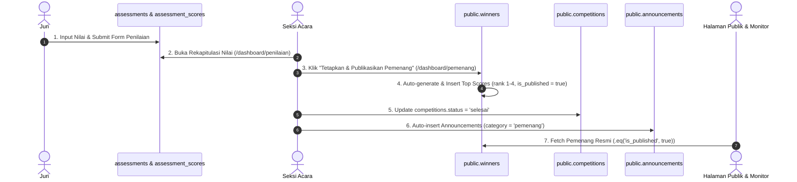

# Panduan Penetapan Pemenang & Reset Testing Database

Dokumen ini berisi dokumentasi teknis mengenai mekanisme penetapan pemenang, alur data dari penilaian juri hingga penayangan publik, serta panduan **Raw SQL Query** untuk melakukan reset status pemenang (khusus pengujian/testing).

---

## 1. Penentu Pemenang & Peringkat Juara

Status penetapan pemenang serta penentuan peringkat juara diatur melalui kombinasi tabel **`winners`**, **`competitions`**, **`registrations`**, dan **`assessments`**.

### A. Penentu Status "Pemenang Ditetapkan"
1. **Keberadaan Baris di Tabel `winners`**:
   - Jika terdapat baris data dengan `competition_id` terkait pada tabel `public.winners`, maka cabang lomba tersebut telah memiliki penetapan pemenang.
2. **Field `winners.is_published`**:
   - `true`: Pemenang sudah dipublikasikan secara resmi dan dapat diakses oleh publik di `/pemenang` serta Layar Monitor Lapangan (`/monitor`).
   - `false`: Data pemenang masih berstatus draf (*draft*) internal panitia.
3. **Field `winners.announced_at`**:
   - Berisi nilai ISO Timestamp waktu publikasi (contoh: `2026-10-05T16:18:27.502Z`).
4. **Field `competitions.status`**:
   - `status = 'selesai'`: Cabang lomba telah ditutup dan juara resmi ditetapkan.
   - `status = 'berlangsung'`: Cabang lomba masih dalam tahap pelaksanaan/penilaian.

### B. Penentu Peringkat & Gelar Juara (Juara 1, 2, 3, Harapan 1)
1. **`winners.rank`**: Integer peringkat peserta (`1` untuk Juara 1, `2` untuk Juara 2, `3` untuk Juara 3, `4` untuk Juara Harapan 1).
2. **`winners.title`**: Text sebutan gelar juara (contoh: `'Juara 1'`, `'Juara 2'`, `'Juara Harapan 1'`).
3. **`winners.final_score`**: Float nilai akhir terakumulasi dari penilaian juri (contoh: `85.85`).
4. **`winners.prize`**: Text rincian hadiah & penghargaan (contoh: `'Uang Pembinaan + Trophy + Sertifikat Juara 1'`).

---

## 2. Alur Data: Dari Penilaian Juri Hingga Pemenang Tampil



### Penjelasan Langkah Alur:
1. **Input Penilaian Juri**: Dewan Juri memasukkan nilai per kriteria di menu Penilaian. Data tersimpan pada tabel `assessments` (header nilai akhir `weighted_total`) dan `assessment_scores` (detail skor per kriteria).
2. **Rekapitulasi Skor**: Server Action `getCompetitionScoringRecap()` menghitung rerata skor akhir per pendaftaran (`registration_id`).
3. **Penetapan Juara**: Server Action `publishCompetitionWinners()` / `publishAllWinners()` mengurutkan skor tertinggi, menetapkan `rank` (1 s.d. 4), lalu memasukkan data pemenang ke tabel `winners`.
4. **Perubahan Status Lomba**: Field `competitions.status` diubah dari `'berlangsung'` menjadi `'selesai'`.
5. **Pengumuman Otomatis**: Sistem membuat pengumuman baru bertipe `category = 'pemenang'` pada tabel `announcements` yang langsung dipasang (*pinned*) pada monitor venue.
6. **Penayangan Publik**: Halaman `/pemenang` dan `/dashboard/pemenang` membaca `winners` yang bernilai `is_published = true`.

---

## 3. Raw SQL Query untuk Reset Testing

Gunakan script SQL berikut pada **SQL Editor Supabase** untuk mengembalikan status cabang lomba (contoh: **Lomba Membaca Puisi** dengan ID `a0000000-0000-0000-0000-000000000001`) menjadi **"Belum Ada Pemenang"** tanpa merusak data nilai juri.

### A. SELECT Query: Cek Kondisi Sebelum Reset
```sql
-- 1. Cek status cabang lomba membaca puisi
SELECT id, slug, name, status 
FROM public.competitions 
WHERE id = 'a0000000-0000-0000-0000-000000000001';

-- 2. Cek data pemenang membaca puisi saat ini
SELECT id, winner_name, rank, title, final_score, is_published, announced_at 
FROM public.winners 
WHERE competition_id = 'a0000000-0000-0000-0000-000000000001';
```

---

### B. RESET Query: Mengembalikan Status ke Belum Ada Pemenang
```sql
BEGIN;

-- 1. Hapus data pemenang khusus cabang lomba Membaca Puisi
DELETE FROM public.winners 
WHERE competition_id = 'a0000000-0000-0000-0000-000000000001';

-- 2. Kembalikan status kompetisi Membaca Puisi menjadi 'berlangsung'
UPDATE public.competitions 
SET status = 'berlangsung',
    updated_at = NOW()
WHERE id = 'a0000000-0000-0000-0000-000000000001';

-- 3. Hapus pengumuman pemenang otomatis jika ada
DELETE FROM public.announcements 
WHERE category = 'pemenang' 
  AND (slug LIKE 'pengumuman-juara%' OR body LIKE '%baca puisi%' OR body LIKE '%Baca Puisi%');

COMMIT;
```

---

### C. SELECT Query: Cek Kondisi Setelah Reset
```sql
-- 1. Pastikan status kompetisi membaca puisi kembali 'berlangsung'
SELECT id, slug, name, status 
FROM public.competitions 
WHERE id = 'a0000000-0000-0000-0000-000000000001';

-- 2. Pastikan data pemenang untuk lomba puisi sudah 0 baris (kosong)
SELECT COUNT(*) AS total_pemenang_puisi 
FROM public.winners 
WHERE competition_id = 'a0000000-0000-0000-0000-000000000001';
```

---

### D. Catatan Keamanan Testing
- **Nilai Penilaian Juri Utuh**: Script ini **TIDAK menghapus** data di tabel `assessments` maupun `assessment_scores`. Rekapitulasi penilaian juri tetap tersimpan aman.
- **Siap Diuji Ulang**: Setelah reset dijalankan, halaman `http://localhost:3000/dashboard/pemenang` akan kembali ke kondisi **"Belum Ada Juara Ditetapkan"**, dan tombol **"Tetapkan & Publikasikan Pemenang"** dapat diuji ulang secara bersih.
