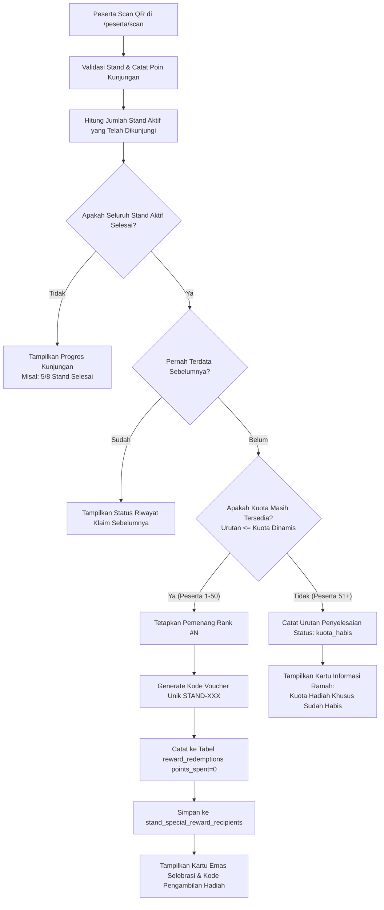

# Dokumentasi Fitur: Reward Khusus Challenge QR Stand Lomba

**Aplikasi:** GebyarBulanBahasa  
**Modul:** Gamifikasi Eksplorasi Stand Budaya & Sistem Reward Otomatis  
**Status:** Produksi / Terintegrasi  

> [!NOTE]  
> **Halaman Terkait:**
> - **Peserta Scan QR (`/peserta/scan`):** Halaman bagi peserta untuk memindai QR code atau memasukkan kode stand 6 karakter, memantau progres jelajah stand, dan menerima voucher hadiah khusus.
> - **Admin Kelola Stand (`/dashboard/challenge/stand`):** Halaman bagi panitia/seksi acara untuk mengelola booth pameran, mengatur batas kuota penerima reward dinamis (default: 50), memilih merchandise, dan memantau daftar pemenang.
> - **Admin Kelola Reward (`/dashboard/challenge/reward`):** Sumber data master katalog merchandise/hadiah dan antrean penyerahan hadiah fisik.

---

## 1. Ikhtisar Fitur (Feature Overview)

Fitur **Reward Khusus Challenge QR Stand Lomba** dirancang untuk mendorong keaktifan peserta dalam mengunjungi dan mengeksplorasi seluruh stand pameran kebudayaan pada festival *Gebyar Bulan Bahasa*.

### Aturan Bisnis Pokok:
1. **Target Penyelesaian Bersifat Dinamis:**
   - Peserta ditantang untuk mengunjungi **seluruh stand aktif** yang terdaftar di database (bukan hardcoded 8 stand). Jika panitia menambah atau menonaktifkan stand, target penyelesaian otomatis menyesuaikan secara *real-time*.
2. **Kuota Pemenang Dinamis (Default: 50 Peserta Pertama):**
   - Hadiah khusus eksklusif hanya diberikan kepada peserta tercepat yang menyelesaikan seluruh stand sesuai kuota yang ditentukan panitia (misal: 50 orang pertama).
3. **Pemberitahuan Kuota Habis (Peserta ke-51 dan seterusnya):**
   - Peserta yang menyelesaikan seluruh stand setelah kuota habis tetap diakui urutan penyelesaiannya (misal: urutan ke-51, 52, dst.), tetapi sistem menampilkan pesan bahwa kuota hadiah khusus telah habis.
4. **Terhubung dengan Katalog Hadiah:**
   - Pilihan hadiah langsung mengacu pada katalog reward aktif yang dikelola di `/dashboard/challenge/reward`.
5. **Anti-Klaim Ganda (*Idempotent*):**
   - Satu peserta hanya dapat tercatat satu kali dalam daftar penyelesaian dan tidak akan menerima hadiah ganda meskipun memindai ulang.

---

## 2. Diagram Alur Kerja Sistem (Workflow)



---

## 3. Panduan Panitia / Administrator (`/dashboard/challenge/stand`)

Pada halaman **Kelola Stand**, terdapat kartu pengaturan khusus: **"Reward Khusus: Eksplorasi Seluruh Stand"**.

### A. Komponen Antarmuka Admin
1. **Statistik Live Real-Time:**
   - **Stand Aktif Wajib:** Jumlah total stand berstatus aktif yang wajib dikunjungi peserta.
   - **Kuota Diberikan:** Rasio kuota yang telah diklaim (contoh: `12 / 50 Peserta`).
   - **Sisa Kuota Tersedia:** Jumlah sisa kursi pemenang yang masih dapat diperebutkan.
   - **Total Menyelesaikan:** Total seluruh peserta yang telah menuntaskan seluruh stand (termasuk yang selesai setelah kuota habis).
2. **Form Pengaturan:**
   - **Status Reward Khusus:** Sakelar toggle untuk mengaktifkan atau menonaktifkan pemberian hadiah otomatis.
   - **Batas Kuota Penerima:** Kolom angka dinamis untuk menentukan berapa jumlah peserta pertama yang berhak mendapat hadiah (dapat diatur 20, 50, 100, dll.).
   - **Pilih Hadiah / Merchandise:** Dropdown yang memuat seluruh katalog reward aktif dari `/dashboard/challenge/reward` lengkap dengan informasi sisa stoknya.
   - **Tombol "Simpan Batas Kuota & Reward":** Menyimpan konfigurasi ke database `event_settings` dan langsung diterapkan tanpa *restart server*.

### B. Memantau Daftar Pemenang (Dialog Antrean)
1. Klik tombol **"Penerima (X)"** di bagian kanan atas kartu reward khusus.
2. Muncul dialog modal berisi tabel daftar peserta:
   - **Urutan:** `#1` s/d `#50` dengan badge emas, `#51+` dengan badge abu-abu (*Kuota Habis*).
   - **Peserta & Instansi:** Nama lengkap dan asal sekolah/kampus peserta.
   - **Kode Pengambilan:** Kode unik voucher (contoh: `STAND-001`, `STAND-015`).
   - **Waktu Selesai:** Waktu presisi saat peserta memindai stand terakhir.
   - **Status:** `DITERIMA` atau `KUOTA HABIS`.
3. **Reset Antrean (Opsional):**  
   Tersedia tombol **"Reset Antrean Penerima"** bagi panitia yang ingin mengosongkan antrean pemenang saat melakukan gladi bersih atau uji coba sebelum hari pelaksanaan festival.

---

## 4. Panduan Pengalaman Peserta (`/peserta/scan`)

### A. Progres Jelajah Stand
Ketika peserta membuka halaman scan, di atas area kamera terdapat kartu **Progres Jelajah Stand Lomba**:
- Menampilkan bilah progres (*progress bar*) persentase kunjungan stand.
- Keterangan teks informatif:  
  *“Progres Jelajah Stand: 6 / 8 Stand — Kunjungi 2 stand lagi untuk memperebutkan Kuota Hadiah Khusus (38 / 50 Tersedia)!”*

### B. Tampilan Saat Masuk Kuota (Pemenang 1 s/d 50)
Ketika memindai stand terakhir dan kuota masih tersedia, peserta akan disambut oleh **Kartu Emas Selebrasi**:
- **Badge:** `🏆 REWARD KHUSUS EKSKLUSIF DIRAIH! (Penerima Ke-#X)`
- **Pesan:** *“Selamat! Anda adalah peserta ke-X dari 50 kuota pertama yang berhasil memindai semua stand pameran budaya!”*
- **Detail Hadiah:** Nama merchandise yang dikonfigurasi admin.
- **Kode Pengambilan:** Kode voucher resmi (misal: `STAND-003`) disertai tombol **Salin Kode**.
- **Instruksi:** Peserta diarahkan untuk menunjukkan kode tersebut ke panitia di stand informasi/penyerahan hadiah.

### C. Tampilan Saat Kuota Habis (Penyelesai ke-51+)
Jika peserta menyelesaikan seluruh stand namun kuota 50 orang telah terpenuhi sebelumnya:
- **Badge:** `🏁 SELURUH STAND TELAH SELESAI (Urutan ke-#51)`
- **Pesan:** *“Hebat! Anda telah berhasil menyelesaikan pemindaian seluruh stand pameran (Urutan ke-51). Namun mohon maaf, kuota reward khusus (untuk 50 peserta pertama) telah habis. Seluruh poin yang Anda kumpulkan tetap tersimpan dan dapat ditukarkan di katalog reward biasa.”*

---

## 5. Spesifikasi Teknis & Arsitektur Database

### A. Struktur File Terkait
| Path File | Fungsi Utama |
|:---|:---|
| [`src/app/actions/stand-rewards.ts`](file:///d:/project/web/energies/gebyar-bulan-bahasa-by-bu-pebri/src/app/actions/stand-rewards.ts) | Server Actions: kalkulasi stand aktif, kuota dinamis, verifikasi pemenang, pencatatan antrean, dan pengambilan progres peserta. |
| [`src/app/actions/challenges.ts`](file:///d:/project/web/energies/gebyar-bulan-bahasa-by-bu-pebri/src/app/actions/challenges.ts) | Menjalankan `checkAndProcessStandCompletionReward()` di dalam aksi `claimStandVisit()`. |
| [`src/app/dashboard/challenge/stand/page.tsx`](file:///d:/project/web/energies/gebyar-bulan-bahasa-by-bu-pebri/src/app/dashboard/challenge/stand/page.tsx) | Antarmuka Admin untuk kelola kuota dinamis, dropdown reward, live metrics, dan modal penerima. |
| [`src/app/peserta/scan/page.tsx`](file:///d:/project/web/energies/gebyar-bulan-bahasa-by-bu-pebri/src/app/peserta/scan/page.tsx) | Antarmuka Peserta untuk memindai QR, progres bar dinamis, dan kartu voucher reward khusus. |

### B. Penyimpanan Database (Supabase PostgreSQL)
1. **Tabel `stands`:**  
   Menyimpan seluruh stand pameran. Query penyelesaian hanya menghitung stand dengan kriteria `is_active = true`.
2. **Tabel `point_transactions`:**  
   Menyimpan riwayat scan setiap stand (`source = 'kode_unik'`). Sistem menghitung jumlah `DISTINCT stand_id` untuk peserta terkait.
3. **Tabel `event_settings`:**  
   - Key: `stand_special_reward_config`  
     Format JSON:
     ```json
     {
       "enabled": true,
       "quota": 50,
       "rewardId": "uuid-dari-tabel-rewards",
       "rewardName": "Tote Bag Kanvas GebyarBulanBahasa",
       "description": "Diberikan khusus untuk 50 peserta pertama yang berhasil mengunjungi seluruh stand pameran budaya."
     }
     ```
   - Key: `stand_special_reward_recipients`  
     Format JSON Array:
     ```json
     [
       {
         "participantId": "uuid-peserta",
         "participantName": "Ahmad Fauzi",
         "institution": "SMA Negeri 1 Jakarta",
         "rank": 1,
         "completedAt": "2026-10-07T10:15:30.000Z",
         "pickupCode": "STAND-001",
         "rewardName": "Tote Bag Kanvas GebyarBulanBahasa",
         "status": "diterima"
       }
     ]
     ```
4. **Tabel `reward_redemptions`:**  
   Ketika peserta masuk kuota (1–50), sistem secara otomatis membuat baris penukaran resmi dengan:
   - `reward_id`: ID reward yang dipilih admin.
   - `participant_id`: ID peserta pemenang.
   - `points_spent`: `0` (hadiah cuma-cuma dari pencapaian misi, tidak mengurangi saldo poin peserta).
   - `pickup_code`: `STAND-XXX`.
   - `status`: `'menunggu'`.
   Hal ini memungkinkan panitia di meja penyerahan hadiah mengecek dan menyerahkan merchandise langsung melalui menu `/dashboard/challenge/reward`.
5. **Tabel `rewards`:**  
   Kolom `claimed_count` bertambah secara otomatis setiap kali ada pemenang yang masuk kuota.

---

## 6. Pertanyaan Umum (FAQ) & Troubleshooting

**Q: Bagaimana jika panitia menambah 1 stand baru di tengah acara?**  
A: Sistem membaca jumlah stand aktif secara langsung dari database. Begitu stand baru berstatus aktif, syarat penyelesaian otomatis bertambah (misalnya dari 8 stand menjadi 9 stand). Peserta yang belum selesai harus mengunjungi stand baru tersebut untuk dapat menyelesaikan challenge.

**Q: Apakah poin peserta berkurang saat mendapatkan reward khusus ini?**  
A: Tidak. Nilai `points_spent` diatur ke `0`. Reward khusus ini merupakan apresiasi murni atas kecepatan peserta menyelesaikan seluruh pos budaya. Saldo poin yang dikumpulkan peserta tetap utuh untuk ditukarkan dengan hadiah lain di katalog reward.

**Q: Bagaimana panitia memverifikasi saat peserta datang mengambil hadiah?**  
A: Panitia cukup meminta peserta menunjukkan kode pengambilan (misal: `STAND-001`). Panitia dapat mencocokkannya di halaman **Daftar Penerima** di `/dashboard/challenge/stand` atau membuka antrean penyerahan di `/dashboard/challenge/reward` lalu menekan tombol **"Serahkan"**.
