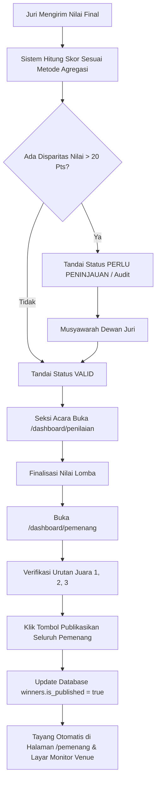

# Panduan & Dokumentasi Sistem Penilaian Lomba
**Aplikasi:** GebyarBulanBahasa  
**Modul:** Penjurian, Agregasi Nilai, Audit Disparitas, dan Penetapan Juara  
**Dokumen Terkait:** [User Guide Seksi Acara](file:///d:/project/web/energies/gebyar-bulan-bahasa-by-bu-pebri/docs/user-guide-seksi-acara.md), [User Guide Juri](file:///d:/project/web/energies/gebyar-bulan-bahasa-by-bu-pebri/docs/user-guide-juri.md)

---

## 1. Pendahuluan & Prinsip Penilaian

Sistem penilaian pada aplikasi **Gebyar Bulan Bahasa** dirancang untuk menjamin:
1. **Objektivitas:** Mengurangi bias personal dewan juri melalui parameter kriteria terukur dan metode agregasi statistik.
2. **Transparansi & Akurasi:** Menghitung skor tertimbang secara otomatis dan presisi hingga dua angka di belakang koma (`0.00`).
3. **Akuntabilitas:** Setiap lembar penilaian juri terkunci dengan stempel waktu (*timestamp*) dan tanda pengenal juri.
4. **Kecepatan Operasional:** Nilai yang dimasukkan juri langsung teragregasi secara *real-time* ke panel rekapitulasi panitia dan layar monitor panggung venue.

---

## 2. Struktur Komponen Nilai

### A. Kriteria Penilaian Berbobot (*Weighted Criteria*)
Setiap cabang lomba memiliki daftar kriteria penilaian independen dengan bobot persentase tertentu.
* **Aturan Mutlak:** Total akumulasi bobot seluruh kriteria dalam satu lomba **wajib tepat 100%**.
* **Skala Input Juri:** Dewan juri memberikan nilai pada rentang **0 hingga 100** untuk masing-masing kriteria.

### B. Rumus Nilai Tertimbang per Juri (*Weighted Total*)
Nilai akhir yang diberikan oleh seorang juri ($J_i$) kepada seorang peserta dihitung dengan rumus:

$$\text{Nilai Juri } (J_i) = \sum_{k=1}^{M} \left( \text{Skor Kriteria}_k \times \frac{\text{Bobot}_k}{100} \right)$$

*Di mana $M$ adalah jumlah kriteria lomba.*

**Contoh Kasus:** Lomba Membaca Puisi (3 Kriteria):
* Penghayatan & Ekspresi (Bobot 40%): Skor 85 &rarr; $85 \times 0.40 = 34.00$
* Artikulasi & Intonasi (Bobot 35%): Skor 90 &rarr; $90 \times 0.35 = 31.50$
* Gestur & Penguasaan Panggung (Bobot 25%): Skor 80 &rarr; $80 \times 0.25 = 20.00$
* **Total Nilai dari Juri 1:** $34.00 + 31.50 + 20.00 = \mathbf{85.50}$

---

## 3. Metode Agregasi Skor Akhir Peserta

Sistem mendukung 3 metode agregasi nilai yang dapat diatur per cabang lomba pada database (`competitions.aggregation`):

### A. Rata-Rata Standar (`rata_rata` / Mean)
* **Definisi:** Menjumlahkan total nilai dari seluruh juri yang bertugas lalu dibagi dengan jumlah juri.
* **Formula:**
  $$\text{Skor Akhir} = \frac{\sum_{i=1}^{N} \text{Nilai Juri}_i}{N}$$
* **Kapan Digunakan:** Cabang lomba dengan jumlah juri 1 sampai 2 orang, atau perlombaan yang karakteristik penjuriannya sangat seragam dan minim risiko disparitas tajam.

---

### B. Total Akumulasi (`total` / Sum)
* **Definisi:** Penjumlahan kumulatif langsung dari total nilai seluruh dewan juri tanpa dibagi.
* **Formula:**
  $$\text{Skor Akhir} = \sum_{i=1}^{N} \text{Nilai Juri}_i$$
* **Kapan Digunakan:** Perlombaan yang menghendaki akumulasi poin murni dari seluruh juri sebagai poin agregat kolektif.

---

### C. Rata-Rata Buang Ekstrem (`rata_rata_buang_ekstrem` / Trimmed Mean / Olympic Scoring)
* **Definisi:** Metode statistik penilaian gaya olimpiade (*Olympic Scoring System*) di mana nilai anomali paling rendah dan paling tinggi dari dewan juri diabaikan sebelum nilai dirata-ratakan.
* **Mekanisme Perhitungan:**
  1. Seluruh nilai dari juri diurutkan dari yang terendah ke tertinggi:
     $$[S_{(1)}, S_{(2)}, S_{(3)}, \dots, S_{(N)}]$$
  2. **Nilai terendah** ($S_{(1)}$) dan **nilai tertinggi** ($S_{(N)}$) dikeluarkan dari himpunan hitung.
  3. Skor akhir dihitung dari rata-rata sisa nilai di tengah:
     $$\text{Skor Akhir} = \frac{\sum_{i=2}^{N-1} S_{(i)}}{N - 2}$$
* **Ketentuan Sistem:**
  * **Minimal 3 Juri:** Metode ini otomatis aktif jika terdapat **minimal 3 dewan juri** yang memberikan nilai final.
  * **Proteksi Fallback:** Apabila juri yang bertugas kurang dari 3 orang, sistem secara otomatis beralih ke perhitungan **Rata-Rata Standar** (*Standard Mean*) guna menghindari hilangnya seluruh data nilai.
* **Tujuan & Manfaat:**
  * Menghilangkan **bias subjektivitas juri** (misalnya juri yang memberikan nilai terlalu rendah atau terlalu tinggi karena preferensi pribadi).
  * Menjaga keadilan (*fair play*), terutama pada cabang lomba seni pertunjukan (*performance art*) seperti Monolog, Teater, Vokal Grup, dan Palang Pintu.

#### Simulasi Perhitungan Trimmed Mean (5 Dewan Juri):
Seorang peserta mendapatkan nilai dari 5 juri:
* Juri 1: `76.00`
* Juri 2: `88.50`
* Juri 3: `90.00`
* Juri 4: `91.50`
* Juri 5: `98.00`

**Langkah:**
1. Urutan skor: `[76.00, 88.50, 90.00, 91.50, 98.00]`
2. Buang ekstrem bawah: `76.00` *(diabaikan)*
3. Buang ekstrem atas: `98.00` *(diabaikan)*
4. Sisa nilai: `88.50, 90.00, 91.50`
5. **Skor Akhir:**
   $$\frac{88.50 + 90.00 + 91.50}{3} = \frac{270.00}{3} = \mathbf{90.00}$$

---

## 4. Deteksi Disparitas Nilai & Sistem Audit (*Score Gap Alert*)

Untuk mengantisipasi ketidaksepahaman mencolok antar-juri, sistem dilengkapi modul pendeteksi disparitas otomatis:

1. **Ambang Batas Selisih (*Threshold*):**
   * Default sistem: **20 poin** (dapat diubah pada menu *Pengaturan Acara*).
   * Dihitung dari selisih nilai tertinggi dan terendah antar-juri:
     $$\Delta \text{Skor} = \max(\text{Nilai Juri}) - \min(\text{Nilai Juri})$$
2. **Klasifikasi Status Audit pada Dashboard Rekap:**
   * **`MENUNGGU JURI` (`default`):** Belum seluruh juri yang ditugaskan mengunggah nilai final.
   * **`VALID` (`success`):** Seluruh juri telah menilai dan selisih skor antar-juri $\le$ ambang batas (wajar).
   * **`PERLU PENINJAUAN` (`danger`):** Terdapat selisih skor $> 20$ poin antar-juri. Sistem memberi tanda peringatan visual agar Ketua Juri dan Panitia Seksi Acara melakukan konfirmasi/musyawarah sebelum hasil difinalisasi.

---

## 5. Penyelesaian Skor Seri (*Tie-Breaker*)

Jika terdapat dua atau lebih peserta yang memiliki total skor akhir yang sama persis:
1. **Prioritas Bobot Kriteria:** Sistem menyarankan evaluasi nilai pada kriteria yang memiliki bobot persentase tertinggi terlebih dahulu.
2. **Sidang Penetapan Manual:** Panitia Seksi Acara dapat membuka modal **"Sidang Penetapan Manual (Seri)"** pada rute `/dashboard/pemenang`.
3. **Pencatatan Berita Acara:** Keputusan hasil rapat dewan juri dituliskan ke dalam sistem dan disimpan secara permanen ke dalam tabel audit log (`activity_logs`).

---

## 6. Alur Penetapan & Publikasi Juara

---

## 7. Lokasi Sumber Kode Terkait

Bagi pengembang yang ingin memodifikasi atau meninjau logika penilaian:
* **Logika Perhitungan Agregasi & Audit:** [`src/app/actions/assessments.ts`](file:///d:/project/web/energies/gebyar-bulan-bahasa-by-bu-pebri/src/app/actions/assessments.ts#L380-L415)
* **Halaman Rekap Nilai Lomba:** [`src/app/dashboard/penilaian/[competitionId]/page.tsx`](file:///d:/project/web/energies/gebyar-bulan-bahasa-by-bu-pebri/src/app/dashboard/penilaian/%5BcompetitionId%5D/page.tsx)
* **Aksi Penetapan & Publikasi Pemenang:** [`src/app/actions/winners.ts`](file:///d:/project/web/energies/gebyar-bulan-bahasa-by-bu-pebri/src/app/actions/winners.ts)
* **Halaman Dashboard Pemenang:** [`src/app/dashboard/pemenang/page.tsx`](file:///d:/project/web/energies/gebyar-bulan-bahasa-by-bu-pebri/src/app/dashboard/pemenang/page.tsx)
* **Tipe Data Agregasi:** [`src/types/database.types.ts`](file:///d:/project/web/energies/gebyar-bulan-bahasa-by-bu-pebri/src/types/database.types.ts#L12) (`AggregationMethod = 'rata_rata' | 'total' | 'rata_rata_buang_ekstrem'`)
